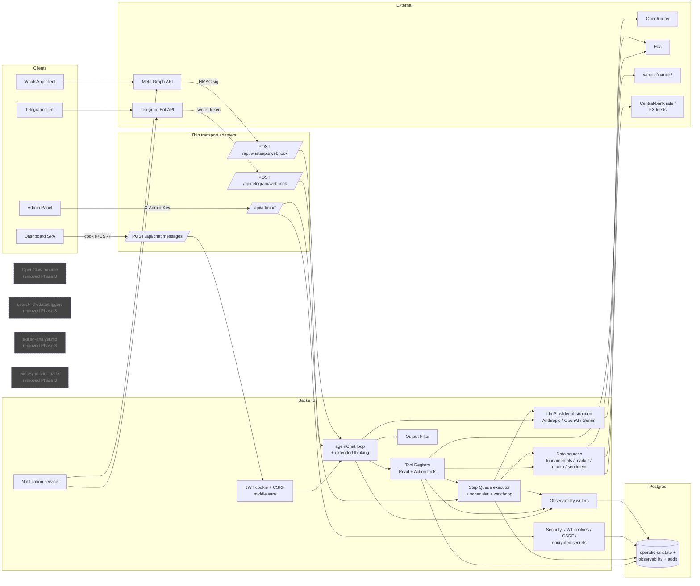
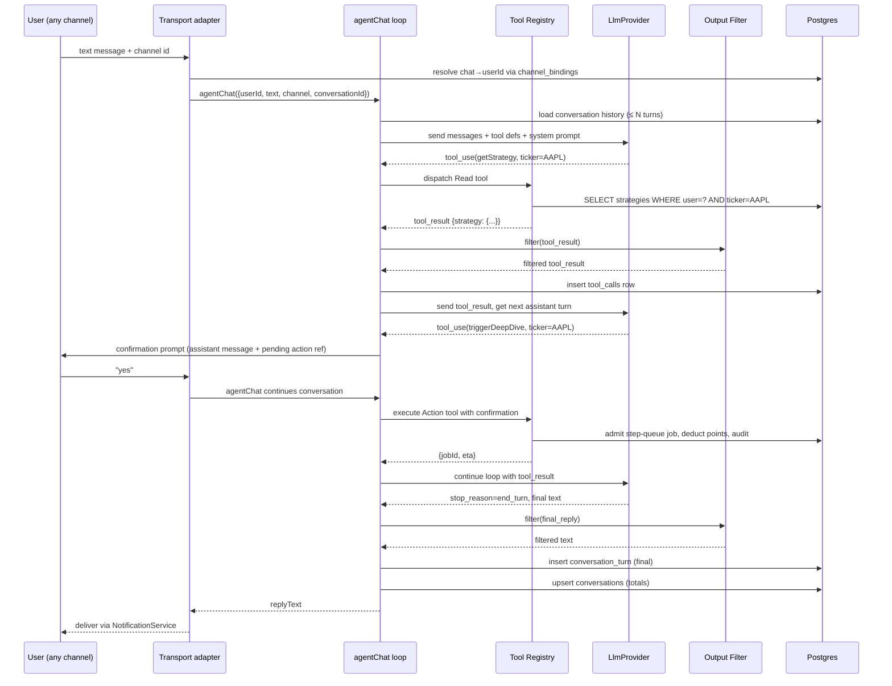
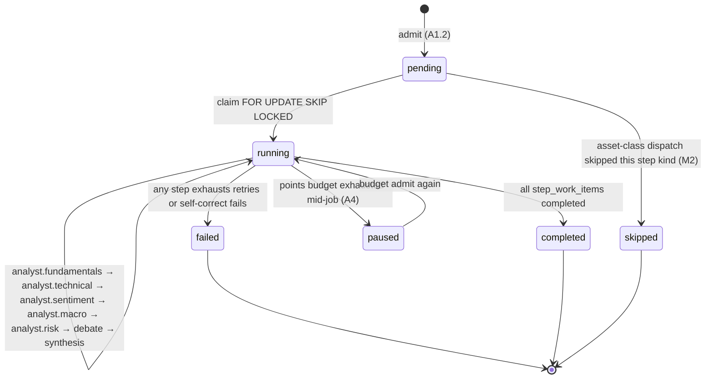

# Design Document — Platform Stabilization and Assistant

## 1. Overview

This initiative collapses three coexisting orchestrators (OpenClaw + legacy `runDailyBriefJob`/`runQuickCheckJob`/`runNewIdeasJob` + the Postgres step queue) onto **one orchestrator: the step queue**, and three duplicate sources of truth (per-user JSON, OpenClaw config, Postgres) onto **one operational source of truth: Postgres**. OpenClaw is removed as an orchestration component (B1–B4). All operational state — strategies, report index, notifications outbox, escalation history, full-report state, deep-dive state, control flags, points budgets, transactions, corporate actions, snoozes, conversations — lives in Postgres after Phase 1 (A2). The only surviving per-user files are `USER.md` (user-owned investor profile) and per-ticker analyst evidence (`data/reports/[ticker]/{fundamentals,technical,sentiment,macro,risk,debate}.json`) (A2.4).

The Assistant axis introduces exactly one chat-agent function — `agentChat({ userId, text, channel, conversationId })` — that fronts three thin transports: dashboard chat pane, Telegram webhook, and a new WhatsApp webhook (C1, D1–D3). The chat agent runs a real provider-native tool-calling loop with extended thinking (G1), persists every conversation turn (C2), and is defended in depth against architecture leakage by three independent layers (F3): a narrow persona prompt that explicitly excludes SOUL/AGENTS/CLAUDE/HEARTBEAT/RESET (F1); a hard-coded Read+Action tool allow-list with Forbidden tools structurally absent (E3, E4); and a deterministic Output Filter that scrubs file paths and internal terms before any text reaches the user (F2). Action tools require explicit user confirmation, deduct points, and are audited individually (E2).

Analysts shift from "fact-fetcher" to "synthesizer" (I1). Numeric facts that today's LLM is asked to invent — MA50, MA200, RSI, P/E, sector P/E, central-bank rate, USD/ILS, position weight — are now fetched or computed deterministically server-side from new `services/dataSources/*` modules; the LLM produces only the prose `*View` fields plus a small set of enums where judgment is genuinely required. Combined with provider-native structured-output schema mode (H1), a single self-correcting retry on Zod failure (H2), and a deterministic placeholder fallback (I1.6, I2), the open `full-report-schema-validation-failure` bug class becomes structurally impossible.

Around these two axes, this design lands first-class portfolio management (transactions ledger with FIFO cost basis (J1, J2); corporate actions (K1); acted-upon (L1); snooze (L2); portfolio-level risk (L3); position-level rule enforcement in code (M1); asset-class-aware dispatch (M2)), removes dishonest UI (`new_ideas` blocked card, fake `pro` plan check, `switch_*` user-facing buttons, fake themes — N1, N3, N4, N5), and closes every item of the security review (O1–O10): mandatory `JWT_SECRET` and `TELEGRAM_SECRET`, CORS allow-list, JWT in `httpOnly Secure SameSite=Strict` cookies with double-submit CSRF, fail-closed auth store, libsodium-encrypted third-party tokens, helmet CSP+HSTS with concrete directives, structured prompt-injection wrapping, admin audit log, and never-log-secrets enforced.

**Resolved Open Questions** (full rationale in §3): (1) WhatsApp inbound = Meta Cloud API direct; (2) encryption = libsodium `crypto_secretbox` with `ENCRYPTION_KEY_HEX` env; (3) plan tiers = removed in this initiative, reintroduced later if needed; (4) chat retention = 90 days for turns/tool_calls, 365 days for conversation summaries; (5) asset-class depth = skip-set only, with `bond` as the documented non-equity dispatch; (6) self-correcting retry = ON by default; (7) defaults = `maxTurns=12`, `conversationTokenCap=120000`, `searchWebMaxResults=8`, `maxWaitForJobSec=600`, `maxSnoozeDays=180`, observability retention 90d, admin audit retention 730d. **Deferred**: future plan-tier product design (out of scope), KMS migration path for §15 encryption (out of scope until cloud move), per-non-equity-class specialized handler depth beyond the bond skip-set (roadmap decision).

---

## 2. Architecture

### 2.1 System component diagram



Ownership and boundaries:

- **HTTP transports** own only request decode, signature/CSRF verification, channel→user binding lookup, and outbound delivery. They contain no model selection, no command parsing, no business branching (D1.4, D2.4, D3.2).
- **`agentChat`** owns the model loop, persona prompt, tool dispatch, and per-turn persistence. It is channel-agnostic except for one audit field (C1.3).
- **Tool Registry** is the chat agent's only world. Tools listed in §8 are *the* allow-list. Filesystem, shell, admin tools, and other-user tools are structurally absent (E3, E4).
- **Step Queue** owns every backend job: `daily_brief`, `quick_check`, `deep_dive`, `full_report`, and (when shipped) `new_ideas` (A1, A4).
- **Postgres** is the single source of truth for operational state (A2). The remaining files are user-owned `USER.md` and per-ticker analyst evidence (A2.4).
- **External providers** (OpenRouter, Exa, yahoo-finance2, central-bank/FX feeds, Telegram, Meta Graph) are reached through narrow service adapters with timeouts and structured errors.
- **Intentionally absent** from the diagram: filesystem/shell tools for the chat agent; OpenClaw runtime config; per-user `data/triggers/`; legacy `~/clawd/data/triggers/` bridge; cron `wakeAgent` calls; analyst skill markdown files; `execSync` in production code (B1–B4).

### 2.2 Chat-agent conversation flow



The loop terminates when (a) the model returns `stop_reason = "end_turn"`, (b) `turnCount >= maxTurns` (truncation), or (c) `tokensUsed >= conversationTokenCap` (cap reached). Each termination case is recorded in `conversations.terminationReason` (C1.5, C1.6).

### 2.3 Step queue lifecycle for one ticker work item



Each step transition is recorded in `step_lifecycle_events` with `from_status`, `to_status`, `attempt_n`, `model_used`, `tier_used`, `error_class`, `error_message`. New `error_class` value `zod_self_corrected` records that a step succeeded after exactly one Zod-failure self-correcting retry (H2.2). New `error_class` values `*_prose_fallback` record when an analyst step succeeded with a deterministic prose placeholder because the LLM call failed or returned blank prose (I1.6, I2.2).

---

## 3. Open-question resolutions

| # | Question | Recommendation | Rationale |
|---|---|---|---|
| 1 | WhatsApp inbound provider | **Meta WhatsApp Cloud API direct** | Outbound delivery already uses `graph.facebook.com/{version}/{phone}/messages`; using the same surface for inbound avoids a second vendor (Twilio/360dialog) and unifies signing. **A**: Meta direct (chosen). **B**: Twilio (more retry plumbing, lower setup friction, but adds vendor + cost). |
| 2 | Encryption scheme for third-party bearer tokens | **libsodium `crypto_secretbox_easy`** with a server-held key in `ENCRYPTION_KEY_HEX` env (32 bytes hex), key id 1, rotation procedure documented in §15 | Zero infra dependency on cloud KMS; Node `libsodium-wrappers` is widely available; KMS migration path is straightforward (the `encrypted_secrets` table includes `key_id` so a second key can coexist during rotation). **A**: libsodium (chosen). **B**: AWS/GCP KMS (better long-term, deferred until cloud move). |
| 3 | Plan tiers | **Remove the fake `pro` check entirely**; daily-brief coverage limit collapses to a single admin-configurable integer. Reintroduce a real `plans` table only when product decides tiers exist. | Honesty principle (N3); prevents UI from advertising tiers that do not exist. |
| 4 | Chat conversation retention window | **`conversation_turns` and `tool_calls`: 90 days; `conversations` summary: 365 days; `output_filter_events`: 365 days; `admin_audit_log`: 730 days; `step_lifecycle_events`: 90 days; `llm_requests`: 90 days; `migration_archive`: 730 days** — all admin-overridable in `feature_flags`-style config | 90 days covers a full ops-debug cycle; year-long summary retention preserves cost reporting; audit retention follows industry default. |
| 5 | Asset-class handler depth | **Ship the dispatch hook (M2.2) plus exactly one explicit non-equity skip-set: `assetClass = "bond"` skips `analyst.technical` (RSI/MACD on a bond ETF is meaningless) and runs the rest of the equity pipeline.** Specialized handlers (e.g. `bond_technical`) are roadmap, not this initiative. | Minimum viable depth that proves the dispatch path; avoids inventing fixed-income analysis we do not yet need. |
| 6 | Self-correcting retry default | **ON by default**, controlled by global `feature_flags.self_correcting_retry_enabled` | The cost is bounded (one extra LLM call per Zod failure) and the bug class it prevents is the open `full-report-schema-validation-failure` bug. |
| 7 | Default values | `maxTurns = 12`, `conversationTokenCap = 120000`, `searchWebMaxResults = 8`, `maxWaitForJobSec = 600`, `maxSnoozeDays = 180`, observability retention values per row 4 | All admin-configurable in `feature_flags` rows; defaults sized to keep one chat conversation under ~$0.50 in worst case. |

---

## 4. Data model — Postgres DDL

All new tables live in the existing `application_postgres` schema (`db/application_postgres.sql`). Every table has `created_at TIMESTAMPTZ NOT NULL DEFAULT NOW()` and (where mutated) `updated_at TIMESTAMPTZ NOT NULL DEFAULT NOW()`. All foreign keys are explicitly named. All time columns are `TIMESTAMPTZ`.

### 4.1 `users`

```sql
CREATE TABLE users (
  user_id            VARCHAR(64) PRIMARY KEY,
  display_name       VARCHAR(128) NOT NULL,
  password_hash      VARCHAR(128) NOT NULL,
  token_version      INTEGER NOT NULL DEFAULT 0,
  schedule           JSONB NOT NULL DEFAULT '{"dailyBriefTime":"08:00","weeklyResearchDay":"sunday","weeklyResearchTime":"19:00","timezone":"Asia/Jerusalem"}'::jsonb,
  rate_limits        JSONB NOT NULL DEFAULT '{}'::jsonb,
  model_tier         VARCHAR(32) NOT NULL DEFAULT 'balanced'
                       CHECK (model_tier IN ('free','cheap','balanced','expensive')),
  model_profile      VARCHAR(64) NOT NULL DEFAULT 'testing',
  lot_method         VARCHAR(16) NOT NULL DEFAULT 'fifo'
                       CHECK (lot_method IN ('fifo','lifo','specific_lot')),
  max_single_position_pct NUMERIC(5,2) NOT NULL DEFAULT 15.00,
  stop_loss_threshold_pct NUMERIC(5,2) NOT NULL DEFAULT 25.00,
  state              VARCHAR(32) NOT NULL DEFAULT 'INCOMPLETE'
                       CHECK (state IN ('INCOMPLETE','BOOTSTRAPPING','ACTIVE','BLOCKED')),
  restriction        VARCHAR(32),
  created_at         TIMESTAMPTZ NOT NULL DEFAULT NOW(),
  updated_at         TIMESTAMPTZ NOT NULL DEFAULT NOW()
);
CREATE INDEX idx_users_state ON users (state);
```

Replaces `users/[id]/auth.json`, `users/[id]/profile.json`, parts of `users/[id]/data/state.json` (state field), `users/[id]/data/config.json` (modelProfile). Written by `/api/auth/login`, admin user mgmt, profile patches; read by every authenticated request after the new cookie middleware loads `users` row by `user_id`. Row lock taken by token-version increment and password change paths (A3.1).

### 4.2 `strategies`

```sql
CREATE TABLE strategies (
  user_id              VARCHAR(64) NOT NULL,
  ticker               VARCHAR(32) NOT NULL,
  version              INTEGER NOT NULL DEFAULT 1,
  asset_scope          VARCHAR(16) NOT NULL DEFAULT 'portfolio'
                         CHECK (asset_scope IN ('portfolio','tracking')),
  tracking_status      VARCHAR(16),
  verdict              VARCHAR(16) NOT NULL
                         CHECK (verdict IN ('BUY','ADD','HOLD','REDUCE','SELL','CLOSE')),
  confidence           VARCHAR(8) NOT NULL CHECK (confidence IN ('high','medium','low')),
  reasoning            TEXT NOT NULL,
  timeframe            VARCHAR(16) NOT NULL,
  position_size_ils    NUMERIC(18,2) NOT NULL DEFAULT 0,
  position_weight_pct  NUMERIC(7,4) NOT NULL DEFAULT 0,
  entry_conditions     JSONB NOT NULL DEFAULT '[]'::jsonb,
  exit_conditions      JSONB NOT NULL DEFAULT '[]'::jsonb,
  catalysts            JSONB NOT NULL DEFAULT '[]'::jsonb,
  bull_case            TEXT,
  bear_case            TEXT,
  last_deep_dive_at    TIMESTAMPTZ,
  deep_dive_triggered_by VARCHAR(64),
  metadata             JSONB NOT NULL,
  stance               VARCHAR(16),
  potential_score      NUMERIC(6,2),
  urgency_score        NUMERIC(6,2),
  urgency_label        VARCHAR(16),
  portfolio_fit_score  NUMERIC(6,2),
  suggested_allocation_pct  NUMERIC(7,4),
  suggested_allocation_ils  NUMERIC(18,2),
  action_catalysts     JSONB NOT NULL DEFAULT '[]'::jsonb,
  avoid_conditions     JSONB NOT NULL DEFAULT '[]'::jsonb,
  next_review_at       TIMESTAMPTZ,
  asset_class          VARCHAR(16) NOT NULL DEFAULT 'equity'
                         CHECK (asset_class IN ('equity','etf','bond','fund','crypto','index','other')),
  created_at           TIMESTAMPTZ NOT NULL DEFAULT NOW(),
  updated_at           TIMESTAMPTZ NOT NULL DEFAULT NOW(),
  PRIMARY KEY (user_id, ticker)
);
CREATE INDEX idx_strategies_user_scope ON strategies (user_id, asset_scope, updated_at DESC);
CREATE INDEX idx_strategies_user_verdict ON strategies (user_id, verdict);
CREATE INDEX idx_strategies_next_review ON strategies (user_id, next_review_at)
  WHERE next_review_at IS NOT NULL;
```

Replaces `data/tickers/[T]/strategy.json` as source of truth (A2.1, A2.2). Step-queue `synthesis` handler writes; `getStrategy` / `getStrategies` tools and dashboard read. Row lock (`SELECT ... FOR UPDATE`) taken on synthesis writeback so concurrent deep-dive completion and chat-agent read see a consistent version (A3.1). The strategy file at `data/tickers/[T]/strategy.json` is regenerated as a derived export only (A2.3) by `services/strategyExportService.ts` after each strategies row change.

### 4.3 `report_index` and `report_batches`

```sql
CREATE TABLE report_batches (
  batch_id        VARCHAR(128) PRIMARY KEY,
  user_id         VARCHAR(64) NOT NULL,
  job_id          VARCHAR(128) NOT NULL,
  mode            VARCHAR(32) NOT NULL,
  triggered_at    TIMESTAMPTZ NOT NULL,
  date            DATE NOT NULL,
  ticker_count    INTEGER NOT NULL DEFAULT 0,
  summary         JSONB,
  highlights      JSONB,
  created_at      TIMESTAMPTZ NOT NULL DEFAULT NOW(),
  CONSTRAINT fk_report_batches_job FOREIGN KEY (job_id)
    REFERENCES jobs(id) ON DELETE CASCADE
);
CREATE INDEX idx_report_batches_user_triggered ON report_batches (user_id, triggered_at DESC);
CREATE INDEX idx_report_batches_user_mode_date ON report_batches (user_id, mode, date DESC);

CREATE TABLE report_index (
  batch_id   VARCHAR(128) NOT NULL,
  ticker     VARCHAR(32) NOT NULL,
  daily_section VARCHAR(16),
  entry      JSONB NOT NULL,
  PRIMARY KEY (batch_id, ticker),
  CONSTRAINT fk_report_index_batch FOREIGN KEY (batch_id)
    REFERENCES report_batches(batch_id) ON DELETE CASCADE
);
CREATE INDEX idx_report_index_ticker ON report_index (ticker);
```

Replaces `data/reports/index/meta.json`, `data/reports/index/page-NNN.json` (A2.1, A2.2). Written by daily-brief / deep-dive / full-report completion effects in the step queue; read by Reports page, feed page, and the `getRecentReports` tool.

### 4.4 `notifications_outbox`

```sql
CREATE TABLE notifications_outbox (
  id            VARCHAR(64) PRIMARY KEY,
  user_id       VARCHAR(64) NOT NULL,
  category      VARCHAR(32) NOT NULL CHECK (category IN ('daily_brief','report','market_news')),
  channel       VARCHAR(16) NOT NULL CHECK (channel IN ('telegram','web','whatsapp')),
  title         VARCHAR(256) NOT NULL,
  body          TEXT NOT NULL,
  ticker        VARCHAR(32),
  batch_id      VARCHAR(128),
  delivered     BOOLEAN NOT NULL DEFAULT FALSE,
  delivered_at  TIMESTAMPTZ,
  read_at       TIMESTAMPTZ,
  error         TEXT,
  created_at    TIMESTAMPTZ NOT NULL DEFAULT NOW()
);
CREATE INDEX idx_notifications_user_created ON notifications_outbox (user_id, created_at DESC);
CREATE INDEX idx_notifications_user_unread ON notifications_outbox (user_id, channel)
  WHERE read_at IS NULL;
CREATE INDEX idx_notifications_user_batch_category ON notifications_outbox (user_id, batch_id, category)
  WHERE batch_id IS NOT NULL;
```

Replaces `users/[id]/data/feed/notifications.json`. Written by `notificationService.publishNotification`; read by `/api/notifications` and the `getNotifications` tool. Idempotency: `(user_id, batch_id, category)` partial index used to skip duplicate publish.

### 4.5 `escalation_history`

```sql
CREATE TABLE escalation_history (
  user_id              VARCHAR(64) NOT NULL,
  ticker               VARCHAR(32) NOT NULL,
  signal_set_fingerprint  VARCHAR(64) NOT NULL,
  job_id               VARCHAR(128) NOT NULL,
  signals              JSONB NOT NULL,
  created_at           TIMESTAMPTZ NOT NULL DEFAULT NOW(),
  PRIMARY KEY (user_id, ticker, signal_set_fingerprint),
  CONSTRAINT fk_escalation_history_job FOREIGN KEY (job_id)
    REFERENCES jobs(id) ON DELETE CASCADE
);
CREATE INDEX idx_escalation_history_user_created ON escalation_history (user_id, created_at DESC);
```

Replaces `users/[id]/data/escalation_history.json`. The `signal_set_fingerprint` is a stable hash of the sorted signal list used by `quickCheckService` so re-escalation on the same signal-set is suppressed via row uniqueness. Snooze suppression (L2) reads this table to decide whether to admit a deep dive.

### 4.6 `position_transactions`

```sql
CREATE TABLE position_transactions (
  id               UUID PRIMARY KEY,
  user_id          VARCHAR(64) NOT NULL,
  ticker           VARCHAR(32) NOT NULL,
  exchange         VARCHAR(16) NOT NULL,
  account          VARCHAR(64) NOT NULL,
  transaction_type VARCHAR(16) NOT NULL
                     CHECK (transaction_type IN ('buy','sell','split','dividend','transfer_in','transfer_out')),
  quantity         NUMERIC(20,8) NOT NULL,
  unit_price       NUMERIC(20,8) NOT NULL,
  unit_currency    VARCHAR(8) NOT NULL,
  fees_ils         NUMERIC(18,4) NOT NULL DEFAULT 0,
  transaction_at   TIMESTAMPTZ NOT NULL,
  note             TEXT,
  lot_id           UUID,
  superseded_by    UUID,
  superseded_at    TIMESTAMPTZ,
  created_at       TIMESTAMPTZ NOT NULL DEFAULT NOW()
);
CREATE INDEX idx_position_transactions_user_ticker_at
  ON position_transactions (user_id, ticker, transaction_at)
  WHERE superseded_at IS NULL;
CREATE INDEX idx_position_transactions_user_at
  ON position_transactions (user_id, transaction_at DESC);
```

Append-only with tombstone semantics: edits write a new row and set `superseded_by`/`superseded_at` on the prior row (J1.2). FIFO cost basis is computed by streaming non-superseded rows ordered by `transaction_at`. Realized vs unrealized P/L derives from lot matches (J1.4, J2.1).

### 4.7 `corporate_actions`

```sql
CREATE TABLE corporate_actions (
  id               UUID PRIMARY KEY,
  user_id          VARCHAR(64),
  ticker           VARCHAR(32) NOT NULL,
  exchange         VARCHAR(16) NOT NULL,
  action_type      VARCHAR(16) NOT NULL CHECK (action_type IN ('split','dividend')),
  ratio_or_amount  NUMERIC(20,8) NOT NULL,
  currency         VARCHAR(8) NOT NULL,
  effective_date   DATE NOT NULL,
  source           VARCHAR(64) NOT NULL,
  reverted_at      TIMESTAMPTZ,
  reverted_reason  TEXT,
  created_at       TIMESTAMPTZ NOT NULL DEFAULT NOW()
);
CREATE INDEX idx_corp_actions_ticker_eff ON corporate_actions (ticker, exchange, effective_date);
CREATE INDEX idx_corp_actions_user_ticker ON corporate_actions (user_id, ticker)
  WHERE user_id IS NOT NULL;
```

`user_id IS NULL` means a global action that applies to every user holding the ticker; non-null is a manual user-specific override (K1.1, K1.4). Step-queue `synthesis` and the `services/transactionStore` adjust derived cost basis through `applyCorporateAction()` (§16.7).

### 4.8 `verdict_actions`

```sql
CREATE TABLE verdict_actions (
  id               UUID PRIMARY KEY,
  user_id          VARCHAR(64) NOT NULL,
  ticker           VARCHAR(32) NOT NULL,
  strategy_version INTEGER NOT NULL,
  decision         VARCHAR(16) NOT NULL
                     CHECK (decision IN ('followed','dismissed','partial_acted')),
  note             TEXT,
  acted_at         TIMESTAMPTZ NOT NULL DEFAULT NOW()
);
CREATE INDEX idx_verdict_actions_user_ticker ON verdict_actions (user_id, ticker, acted_at DESC);
```

L1.1–L1.4. Written by the `markVerdictAddressed` tool (E2.1) and the dashboard "acted-upon" button.

### 4.9 `ticker_snoozes`

```sql
CREATE TABLE ticker_snoozes (
  id                       UUID PRIMARY KEY,
  user_id                  VARCHAR(64) NOT NULL,
  ticker                   VARCHAR(32) NOT NULL,
  snooze_until             TIMESTAMPTZ NOT NULL,
  signal_set_fingerprint   VARCHAR(64) NOT NULL,
  reason                   TEXT,
  created_at               TIMESTAMPTZ NOT NULL DEFAULT NOW()
);
CREATE INDEX idx_ticker_snoozes_active ON ticker_snoozes (user_id, ticker, snooze_until DESC)
  WHERE snooze_until > NOW();
```

L2.1–L2.4. The chat-agent `snoozeTicker` tool and the per-position dashboard snooze button write here. Quick-check escalation logic reads this table before admitting a deep dive (§16.7).

### 4.10 `portfolio_risk_snapshots`

```sql
CREATE TABLE portfolio_risk_snapshots (
  id                                UUID PRIMARY KEY,
  user_id                           VARCHAR(64) NOT NULL,
  snapshot_at                       TIMESTAMPTZ NOT NULL DEFAULT NOW(),
  total_value_ils                   NUMERIC(18,2) NOT NULL,
  concentration_by_single_name_pct  JSONB NOT NULL,
  concentration_by_sector_pct       JSONB NOT NULL,
  concentration_by_currency_pct     JSONB NOT NULL,
  concentration_by_asset_class_pct  JSONB NOT NULL,
  largest_single_position_ticker    VARCHAR(32),
  largest_single_position_pct       NUMERIC(7,4)
);
CREATE INDEX idx_portfolio_risk_user_snapshot
  ON portfolio_risk_snapshots (user_id, snapshot_at DESC);
```

Latest row per user serves the `getRiskSummary` tool and the dashboard portfolio-risk view (L3.1–L3.3).

### 4.11 `conversations`, `conversation_turns`, `tool_calls`

```sql
CREATE TABLE conversations (
  id                   VARCHAR(64) PRIMARY KEY,
  user_id              VARCHAR(64) NOT NULL,
  channel              VARCHAR(16) NOT NULL CHECK (channel IN ('dashboard','telegram','whatsapp')),
  started_at           TIMESTAMPTZ NOT NULL DEFAULT NOW(),
  ended_at             TIMESTAMPTZ,
  turn_count           INTEGER NOT NULL DEFAULT 0,
  total_tokens_in      INTEGER NOT NULL DEFAULT 0,
  total_tokens_out     INTEGER NOT NULL DEFAULT 0,
  total_cost_usd       NUMERIC(14,6) NOT NULL DEFAULT 0,
  termination_reason   VARCHAR(32),
  tool_call_count      INTEGER NOT NULL DEFAULT 0,
  model                VARCHAR(255)
);
CREATE INDEX idx_conversations_user_started ON conversations (user_id, started_at DESC);
CREATE INDEX idx_conversations_termination_reason
  ON conversations (termination_reason, started_at DESC)
  WHERE termination_reason IS NOT NULL;

CREATE TABLE conversation_turns (
  conversation_id  VARCHAR(64) NOT NULL,
  turn_index       INTEGER NOT NULL,
  role             VARCHAR(16) NOT NULL CHECK (role IN ('user','assistant','tool_result','system')),
  content          JSONB NOT NULL,
  model            VARCHAR(255),
  tokens_in        INTEGER NOT NULL DEFAULT 0,
  tokens_out       INTEGER NOT NULL DEFAULT 0,
  cost_usd         NUMERIC(14,6) NOT NULL DEFAULT 0,
  latency_ms       INTEGER NOT NULL DEFAULT 0,
  created_at       TIMESTAMPTZ NOT NULL DEFAULT NOW(),
  PRIMARY KEY (conversation_id, turn_index),
  CONSTRAINT fk_conversation_turns_conv FOREIGN KEY (conversation_id)
    REFERENCES conversations(id) ON DELETE CASCADE
);

CREATE TABLE tool_calls (
  id                UUID PRIMARY KEY,
  conversation_id   VARCHAR(64) NOT NULL,
  turn_index        INTEGER NOT NULL,
  tool_name         VARCHAR(64) NOT NULL,
  category          VARCHAR(16) NOT NULL CHECK (category IN ('read','action')),
  args_json         JSONB NOT NULL,
  result_status     VARCHAR(16) NOT NULL CHECK (result_status IN ('success','error','rejected')),
  result_latency_ms INTEGER NOT NULL DEFAULT 0,
  cost_points       NUMERIC(18,6) NOT NULL DEFAULT 0,
  audit_note        TEXT,
  occurred_at       TIMESTAMPTZ NOT NULL DEFAULT NOW(),
  CONSTRAINT fk_tool_calls_conv FOREIGN KEY (conversation_id)
    REFERENCES conversations(id) ON DELETE CASCADE
);
CREATE INDEX idx_tool_calls_conv ON tool_calls (conversation_id, occurred_at);
CREATE INDEX idx_tool_calls_tool_name_at ON tool_calls (tool_name, occurred_at DESC);
```

C1.4, C2.1, C2.2, C2.3. The `tool_calls.cost_points = 0` for Read tools (E1.2); Action tools record their points cost (E2.3). `audit_note` records confirmation token, snooze fingerprint, etc.

### 4.12 `output_filter_events`

```sql
CREATE TABLE output_filter_events (
  id                  BIGSERIAL PRIMARY KEY,
  conversation_id     VARCHAR(64) NOT NULL,
  turn_index          INTEGER NOT NULL,
  pattern             VARCHAR(128) NOT NULL,
  site_of_match       VARCHAR(16) NOT NULL CHECK (site_of_match IN ('tool_result','final_reply')),
  original_length_chars INTEGER NOT NULL,
  occurred_at         TIMESTAMPTZ NOT NULL DEFAULT NOW(),
  CONSTRAINT fk_output_filter_events_conv FOREIGN KEY (conversation_id)
    REFERENCES conversations(id) ON DELETE CASCADE
);
CREATE INDEX idx_output_filter_events_at ON output_filter_events (occurred_at DESC);
```

F2.3. Each substitution writes one row.

### 4.13 `admin_audit_log`

```sql
CREATE TABLE admin_audit_log (
  id              BIGSERIAL PRIMARY KEY,
  actor_admin_id  VARCHAR(64) NOT NULL,
  action_type     VARCHAR(64) NOT NULL,
  target_user_id  VARCHAR(64),
  args_json       JSONB,
  result_status   VARCHAR(16) NOT NULL CHECK (result_status IN ('success','error','rejected')),
  request_id      VARCHAR(64) NOT NULL,
  ip_address      VARCHAR(64),
  occurred_at     TIMESTAMPTZ NOT NULL DEFAULT NOW()
);
CREATE INDEX idx_admin_audit_log_actor_at ON admin_audit_log (actor_admin_id, occurred_at DESC);
CREATE INDEX idx_admin_audit_log_target_at
  ON admin_audit_log (target_user_id, occurred_at DESC)
  WHERE target_user_id IS NOT NULL;
CREATE INDEX idx_admin_audit_log_action_at ON admin_audit_log (action_type, occurred_at DESC);
```

O9.1, O9.2. Written by the new `services/security/adminAuditStore.ts` from a global middleware mounted on `/api/admin/*`.

### 4.14 `migration_archive`

```sql
CREATE TABLE migration_archive (
  id              UUID PRIMARY KEY,
  user_id         VARCHAR(64) NOT NULL,
  source_path     VARCHAR(512) NOT NULL,
  reason          VARCHAR(64) NOT NULL,
  payload         JSONB NOT NULL,
  archived_at     TIMESTAMPTZ NOT NULL DEFAULT NOW()
);
CREATE INDEX idx_migration_archive_user_archived
  ON migration_archive (user_id, archived_at DESC);
```

A2.5, A2.6, P2.2. The migration command writes a row whenever it skips a corrupt or unparseable file or destructively retires a JSON file.

### 4.15 `feature_flags`

```sql
CREATE TABLE feature_flags (
  flag_name        VARCHAR(64) NOT NULL,
  scope_user_id    VARCHAR(64),
  enabled          BOOLEAN NOT NULL,
  value_json       JSONB,
  updated_at       TIMESTAMPTZ NOT NULL DEFAULT NOW(),
  updated_by       VARCHAR(64) NOT NULL,
  PRIMARY KEY (flag_name, COALESCE(scope_user_id, ''))
);
CREATE INDEX idx_feature_flags_global ON feature_flags (flag_name)
  WHERE scope_user_id IS NULL;
```

P3.1, P3.2. Holds both feature toggles (`chat_agent_enabled`, `output_filter_enabled`, `structured_outputs_enabled`, `self_correcting_retry_enabled`, `asset_class_dispatch_enabled`, `transactions_ledger_enabled`, `snooze_enabled`) and admin-configurable values (`max_turns`, `conversation_token_cap`, `search_web_max_results`, `max_wait_for_job_sec`, `max_snooze_days`, `forbidden_pattern_list`, `cors_allow_list`, `coverage_limit`, etc.). Toggling a flag writes one `admin_audit_log` row (P3.2).

### 4.16 `channel_bindings`

```sql
CREATE TABLE channel_bindings (
  channel              VARCHAR(16) NOT NULL CHECK (channel IN ('telegram','whatsapp')),
  channel_identifier   VARCHAR(128) NOT NULL,
  user_id              VARCHAR(64) NOT NULL,
  conversation_id      VARCHAR(64),
  bound_at             TIMESTAMPTZ NOT NULL DEFAULT NOW(),
  unbound_at           TIMESTAMPTZ,
  PRIMARY KEY (channel, channel_identifier),
  CONSTRAINT fk_channel_bindings_user FOREIGN KEY (user_id)
    REFERENCES users(user_id) ON DELETE CASCADE
);
CREATE INDEX idx_channel_bindings_user_active
  ON channel_bindings (user_id, channel)
  WHERE unbound_at IS NULL;
```

D1.1, D2.3. The Telegram webhook resolves `chatId` and the WhatsApp webhook resolves the inbound phone via this table. The `conversation_id` is set on first message and reused for subsequent messages (D1.2, D2.3).

### 4.17 `encrypted_secrets`

```sql
CREATE TABLE encrypted_secrets (
  id              UUID PRIMARY KEY,
  user_id         VARCHAR(64) NOT NULL,
  secret_kind     VARCHAR(32) NOT NULL CHECK (secret_kind IN ('telegram_bot_token','whatsapp_access_token','whatsapp_app_secret')),
  ciphertext      BYTEA NOT NULL,
  nonce           BYTEA NOT NULL,
  key_id          INTEGER NOT NULL,
  ciphertext_hash CHAR(8) NOT NULL,
  created_at      TIMESTAMPTZ NOT NULL DEFAULT NOW(),
  rotated_at      TIMESTAMPTZ
);
CREATE UNIQUE INDEX idx_encrypted_secrets_user_kind
  ON encrypted_secrets (user_id, secret_kind);
```

O5.1–O5.4. `key_id` allows rotation: a new key is added to the in-memory keyring; new writes use the new key; the rotation job re-encrypts old rows; old keys are removed when no rows reference them. `ciphertext_hash` is the last 4 chars of the ciphertext hex used as a stable identifier for logs (O10.2).

### 4.18 New `chat_agent` step kind and related extensions

`model_tier_assignments` is **not** schema-changed; the new step kind `chat_agent` is inserted into existing rows by `ensureDefaultModelTierAssignments()`:

```sql
INSERT INTO model_tier_assignments (tier, step_kind, model, fallback, updated_at, updated_by) VALUES
  ('free',      'chat_agent', 'meta-llama/llama-3.3-70b-instruct:free', NULL, NOW(), 'system_default'),
  ('cheap',     'chat_agent', 'google/gemini-2.5-flash',                NULL, NOW(), 'system_default'),
  ('balanced',  'chat_agent', 'claude-sonnet-4-6',                      NULL, NOW(), 'system_default'),
  ('expensive', 'chat_agent', 'claude-opus-4-7',                        NULL, NOW(), 'system_default')
ON CONFLICT (tier, step_kind) DO NOTHING;
```

The TypeScript `STEP_KINDS` constant adds `'chat_agent'`.

`step_lifecycle_events.error_class` accepts new values: `zod_self_corrected`, `fundamentals_prose_fallback`, `technical_prose_fallback`, `sentiment_prose_fallback`, `macro_prose_fallback`, `risk_prose_fallback`. No DDL change is required (column is `VARCHAR(64)`).

`jobs.assetClass`: nullable `VARCHAR(16)` (see §5).


---

## 5. Existing-table changes

```sql
ALTER TABLE jobs
  ADD COLUMN IF NOT EXISTS asset_class VARCHAR(16) DEFAULT NULL
    CHECK (asset_class IS NULL OR asset_class IN ('equity','etf','bond','fund','crypto','index','other')),
  ADD COLUMN IF NOT EXISTS conversation_id VARCHAR(64);

ALTER TABLE ticker_work_items
  ADD COLUMN IF NOT EXISTS asset_class VARCHAR(16) DEFAULT NULL
    CHECK (asset_class IS NULL OR asset_class IN ('equity','etf','bond','fund','crypto','index','other'));

ALTER TABLE step_work_items
  ADD COLUMN IF NOT EXISTS schema_mode VARCHAR(32) DEFAULT NULL
    CHECK (schema_mode IS NULL OR schema_mode IN ('provider_native','normalize_fallback','both')),
  ADD COLUMN IF NOT EXISTS structured_output_provider VARCHAR(32) DEFAULT NULL,
  ADD COLUMN IF NOT EXISTS prose_fallback_used BOOLEAN NOT NULL DEFAULT FALSE;

ALTER TABLE step_lifecycle_events
  -- error_class is already VARCHAR(64); no DDL change.
  -- New accepted values: 'zod_self_corrected', '*_prose_fallback'.
  ADD COLUMN IF NOT EXISTS schema_mode VARCHAR(32) DEFAULT NULL;

ALTER TABLE model_tier_assignments
  -- step_kind is VARCHAR(64); the new value 'chat_agent' is inserted by ensureDefaultModelTierAssignments.
  ADD COLUMN IF NOT EXISTS thinking_budget INTEGER NOT NULL DEFAULT 0,
  ADD COLUMN IF NOT EXISTS provider VARCHAR(32) NOT NULL DEFAULT 'openrouter';

ALTER TABLE llm_requests
  ADD COLUMN IF NOT EXISTS conversation_id VARCHAR(64),
  ADD COLUMN IF NOT EXISTS tool_call_id UUID,
  ADD COLUMN IF NOT EXISTS schema_mode VARCHAR(32);
CREATE INDEX IF NOT EXISTS idx_llm_requests_conv_at
  ON llm_requests (conversation_id, occurred_at DESC)
  WHERE conversation_id IS NOT NULL;
CREATE INDEX IF NOT EXISTS idx_llm_requests_tool_call
  ON llm_requests (tool_call_id)
  WHERE tool_call_id IS NOT NULL;

ALTER TABLE tracked_assets
  ADD COLUMN IF NOT EXISTS asset_class VARCHAR(16) DEFAULT 'equity'
    CHECK (asset_class IN ('equity','etf','bond','fund','crypto','index','other'));

ALTER TABLE user_points_budgets
  -- No schema change. Per-conversation cap is held in feature_flags as
  -- conversation_token_cap (global) or per-user override via scope_user_id.
  ADD COLUMN IF NOT EXISTS conversation_token_cap_override INTEGER;
```

**Field semantics and writers**:

- `jobs.asset_class` records the asset class the job was admitted for so admin can audit dispatch decisions; written by `admitStepQueueJob`. Single-ticker jobs (`deep_dive`, `quick_check`) read from `strategies.asset_class` or fall back to `equity`.
- `jobs.conversation_id` correlates jobs admitted by a chat-agent Action tool with their conversation; written by `triggerDeepDive` / `triggerQuickCheck` handlers.
- `ticker_work_items.asset_class` is the per-ticker dispatch decision used by `expandJobByAssetClass()` (§10).
- `step_work_items.schema_mode` records which structured-output strategy succeeded — `provider_native` if the provider's schema-bound call returned valid output on the first try, `normalize_fallback` if `normalizeRaw` repaired it, `both` if the provider call returned and normalize then re-tightened (e.g., enum coercion). Required by H1.4.
- `step_work_items.prose_fallback_used` is `TRUE` when the deterministic placeholder for `*View` prose was used because the LLM call failed or returned blank prose (I1.6, I2.2).
- `model_tier_assignments.thinking_budget` is the extended-thinking budget (Anthropic) or reasoning budget (OpenAI o-series) for steps that benefit from it — currently only `synthesis`, `debate`, `chat_agent`. `0` means disabled.
- `model_tier_assignments.provider` is `openrouter | anthropic | openai | gemini`; the `LlmProvider` factory dispatches on this column.
- `llm_requests.conversation_id` and `tool_call_id` correlate proxy entries with chat-agent activity; written by the new `LlmProvider` shim.

**Migration strategy for existing rows**:

- `jobs.asset_class` and `ticker_work_items.asset_class` default to NULL; on first read after migration the asset-class dispatcher backfills `equity` for existing rows that have no override (M2.3).
- `step_work_items.schema_mode = NULL` for rows created before the H1 cutover; new code paths always populate it.
- `model_tier_assignments.thinking_budget` defaults to `0` for all current rows; admin sets per tier via the existing PATCH endpoint after the H3 ship.
- `tracked_assets.asset_class` defaults to `equity`; admin or the ingestion path can update to `bond` etc.
- `user_points_budgets.conversation_token_cap_override` is NULL for all existing rows; the global value from `feature_flags` applies until set.

---

## 6. Service / module map

### 6.1 New modules

#### Chat agent
- `backend/src/services/chat/agentChat.ts` — the single `agentChat({...})` entry point. Implements C1, G1, G2, F1, F3.
- `backend/src/services/chat/personaPrompt.ts` — exports `buildPersonaPrompt(userDisplayName)`. Holds the literal redirect line and the explicit forbidden-content list (F1).
- `backend/src/services/chat/tools/registry.ts` — `buildToolRegistry(ctx: ToolContext)` returning the typed Read+Action tool array. Verifies allow-list at build time (E4.1).
- `backend/src/services/chat/tools/readTools.ts` — implementations of `getPortfolio`, `getStrategy`, `getStrategies`, `getRecentReports`, `getCatalystsDueSoon`, `getEscalationHistory`, `getRiskSummary`, `getNotifications`, `searchWeb` (E1.1).
- `backend/src/services/chat/tools/actionTools.ts` — implementations of `triggerQuickCheck`, `triggerDeepDive`, `triggerDailyBrief`, `snoozeTicker`, `markVerdictAddressed`, `waitForJob` (E2.1, E2.5, E2.6, G2.1, G2.2).
- `backend/src/services/chat/outputFilter.ts` — exports `filterText(input, ctx)` returning `{ text, substitutions[] }` (F2).
- `backend/src/services/chat/conversationStore.ts` — read/write `conversations`, `conversation_turns`, `tool_calls` rows (C2.1–C2.3).
- `backend/src/services/chat/llmProviders/index.ts` — `LlmProvider` interface and `getLlmProvider(model, schemaMode)` factory.
- `backend/src/services/chat/llmProviders/anthropicProvider.ts` — Anthropic tool-use + extended thinking implementation.
- `backend/src/services/chat/llmProviders/openAiProvider.ts` — OpenAI strict tools implementation.
- `backend/src/services/chat/llmProviders/geminiProvider.ts` — Gemini schema-mode + structured tools implementation.
- `backend/src/services/chat/llmProviders/openRouterProvider.ts` — fallback for openrouter-namespaced models when no native provider is configured (used for `free`/`cheap` tiers).
- `backend/src/services/chat/confirmationStore.ts` — short-lived per-conversation pending-action store (in-memory) for E2.2 confirmation handshake (§7.4).

#### Transports
- `backend/src/routes/chat.ts` — `POST /api/chat/messages` dashboard endpoint, JWT-cookie + CSRF authenticated (D3, O3).
- `backend/src/routes/whatsapp.ts` — `POST /api/whatsapp/webhook` (D2). Verifies `X-Hub-Signature-256` against the encrypted WhatsApp app secret.
- `backend/src/routes/telegram.ts` — **rewritten** as a thin transport: secret verification → channel binding lookup → `agentChat` → `notificationService.deliverTelegram` (D1).

#### Step-queue extensions
- `backend/src/services/stepQueue/handlers/chatAgent.ts` — handler for the new `chat_agent` step kind (one-shot LLM calls invoked by Action tools that need an internal small LLM call).
- `backend/src/services/stepQueue/expansion.ts` — extended with `expandJobByAssetClass({ ticker, assetClass })` returning `StepKind[]` (M2).
- `backend/src/services/stepQueue/structuredOutputs.ts` — provider-native schema-bound LLM call helper used by analyst handlers (H1).
- `backend/src/services/stepQueue/selfCorrectingRetry.ts` — single-retry-on-Zod-failure wrapper (H2).
- `backend/src/services/stepQueue/handlers/quickCheck.ts` — new step kind `quick_check.evaluate` for daily-brief expansion (§12).
- `backend/src/services/stepQueue/handlers/dailyBrief.ts` — `tracking.evaluate` step kind for tracked-asset evaluation in the daily brief (§12).
- `backend/src/services/stepQueue/handlers/newIdeas.ts` — only added if `new_ideas` is shipped in this initiative (N1.1).

#### Operational state in Postgres
- `backend/src/services/strategyStore.ts` — `readStrategy`, `writeStrategy`, `listStrategies`, `bumpVersion` against `strategies` table.
- `backend/src/services/strategyExportService.ts` — generates derived `data/tickers/[T]/strategy.json` files from `strategies` rows for backward compat (A2.3).
- `backend/src/services/reportIndexStore.ts` — replaces `data/reports/index/*.json` reads/writes.
- `backend/src/services/notificationStore.ts` — replaces `feed/notifications.json` reads/writes (used by `notificationService`).
- `backend/src/services/escalationHistoryStore.ts` — replaces `data/escalation_history.json`.
- `backend/src/services/snoozeStore.ts` — `ticker_snoozes` CRUD + `findActiveSnooze(userId, ticker, signalSetFingerprint)`.
- `backend/src/services/transactionStore.ts` — `position_transactions` CRUD + FIFO cost-basis computation (J1, J2).
- `backend/src/services/portfolioRiskStore.ts` — `portfolio_risk_snapshots` writer + reader.
- `backend/src/services/security/adminAuditStore.ts` — `admin_audit_log` writer used by global admin middleware.
- `backend/src/services/channelBindingStore.ts` — `channel_bindings` CRUD; `bindChannel`, `lookupByChannelId`.
- `backend/src/services/security/encryptedSecretsStore.ts` — libsodium-backed read/write/rotate of `encrypted_secrets` rows (O5).
- `backend/src/services/verdictActionsStore.ts` — `verdict_actions` CRUD.
- `backend/src/services/corporateActionsStore.ts` — `corporate_actions` CRUD + `applyCorporateAction(userId, ticker, ratio, effectiveDate)`.
- `backend/src/services/migrationArchiveStore.ts` — `migration_archive` writer (used by migration scripts).

#### Cron / scheduling (rewritten)
- `backend/src/services/scheduler/dailyScheduler.ts` — rewritten daily-brief scheduler that emits step-queue jobs (no agent/cron coupling), takes a `SELECT … FOR UPDATE` lease per minute key to prevent duplicate firing across multiple replicas.
- `backend/src/services/scheduler/watchdog.ts` — Postgres-only watchdog: reads stuck `jobs` and `step_work_items` rows and applies the action-specific timeout policy currently in `watchdogService.ts`. No filesystem reads.

#### Analyst data sources
- `backend/src/services/dataSources/fundamentalsSource.ts` — fetches deterministic fundamentals (earnings, EPS expectations, P/E, sector P/E, analyst consensus, balance-sheet category, insider activity) via yahoo-finance2 + Exa (cached). Returns a typed `FundamentalsFacts` object (I1.1).
- `backend/src/services/dataSources/marketDataSource.ts` — `getPriceHistorySeries(ticker, range)`, `computeMa(series, n)`, `computeRsi(series)`, `computeMacd(series)`, `computeKeyLevels(series)` (I1.2).
- `backend/src/services/dataSources/macroSource.ts` — central-bank rate (Fed, BoI, ECB) + sector performance + USD/ILS + geopolitical risk level pulled from configured feeds (I1.3).
- `backend/src/services/dataSources/sentimentSource.ts` — Exa news + analyst-action snippets with deterministic polarity classification (I1.4).
- `backend/src/services/dataSources/cache.ts` — shared TTL cache (in-memory + on-disk under `data/cache/`).

#### Security
- `backend/src/services/security/jwtCookies.ts` — `setJwtCookie(res, userId, tokenVersion)`, `clearJwtCookie(res)`, `extractJwtFromCookie(req)` (O3).
- `backend/src/services/security/csrf.ts` — double-submit cookie issuance + verification middleware (O3.3).
- `backend/src/services/security/encryption.ts` — libsodium `crypto_secretbox_easy/open_easy` wrapper, key rotation hook (O5).
- `backend/src/services/security/startupGuards.ts` — startup-time invariant checks: refuses to start on missing/`changeme` `JWT_SECRET` (O1), missing `TELEGRAM_SECRET` (O6, D1.5), missing `ENCRYPTION_KEY_HEX` (O5.3), empty CORS allow-list (O2.2), unset CSP `script-src`/`connect-src` (O7.3), empty Output Filter pattern list (F3.3), Forbidden tools registered (F3.2), empty persona prompt (F3.1), `execSync` lint failure (B4.3).
- `backend/src/services/security/secretsLogger.ts` — logger wrapper that redacts known secret-bearing fields and replaces them with last-4 + hash prefix (O10.2).
- Hardened `backend/src/app.ts` — helmet CSP+HSTS configured (§15), CORS allow-list (§15), CSRF middleware mounted before all state-changing routes, admin audit middleware mounted on `/api/admin/*`.

#### Migration tooling
- `backend/src/scripts/migrateUserStateToPostgres.ts` — per-user idempotent migration of `auth.json`, `profile.json`, `data/state.json`, `data/escalation_history.json`, `data/feed/notifications.json`, all `data/tickers/[T]/strategy.json`, `data/reports/index/*.json`, `data/reports/[T]/full_report_state.json`, `data/reports/[T]/deep_dive_state.json` (A2.5, A2.6). Writes `migration_archive` rows for corrupt input.
- `backend/src/scripts/cleanupOpenClawWorkspaces.ts` — idempotent removal of per-user `SOUL.md`, `AGENTS.md`, `HEARTBEAT.md`, `RESET.md`, `data/triggers/`, `skills` symlinks (B2.2). Writes `migration_archive` rows for everything removed.
- `backend/src/scripts/migrateFakeNewIdeasUI.ts` — frontend-side cleanup helper invoked from the build (or the dead-code paths are simply deleted — chosen approach in §17).

### 6.2 Modules deleted at end of each phase

| Module | Phase that deletes |
|---|---|
| `services/agentService.ts` (entire OpenClaw-management surface) | Phase 3 (B1.1, B1.2) |
| `services/llm/oneshotCall.ts` (free-form `json_object`) | Phase 4, replaced by `services/stepQueue/structuredOutputs.ts` (H1.2) |
| `services/quickCheckService.ts` legacy entry-point | Phase 2 (replaced by step-queue `quick_check.evaluate`) |
| `services/dailyBriefService.ts` legacy entry-point | Phase 2 |
| `services/newIdeasService.ts` (if not shipped) | Phase 10 (N1.1) |
| `services/llmProxy.ts` proxy router (`backend/src/routes/llmProxy.ts`) | Phase 3 — no agent runtime calls the proxy after OpenClaw retirement |
| `services/jobCompletionService.ts`, `services/watchdogService.ts` (legacy file-based) | Phase 3 (replaced by scheduler/watchdog Postgres-only) |
| `services/telegramRouter.ts` slash-command parsing | Phase 6 (D1.4) |
| `services/sanitizerService.ts` as primary defense | Phase 5 (downgraded to coarse abuse filter only — O8.3) |
| `skills/fundamentals-analyst.md`, `skills/technical-analyst.md`, `skills/sentiment-analyst.md`, `skills/macro-analyst.md`, `skills/portfolio-risk.md`, `skills/bull-researcher.md`, `skills/bear-researcher.md` | Phase 3 (B3.1) |
| `users/[id]/SOUL.md`, `AGENTS.md`, `HEARTBEAT.md`, `RESET.md` symlinks/copies | Phase 3 (B2.2) |
| `users/[id]/data/triggers/`, `/root/clawd/data/triggers/` | Phase 3 (B1.3, B1.5) |
| `frontend/src/pages/Controls.tsx` `switch_*` cards | Phase 10 (N4.1) |
| `frontend/` theme picker variants beyond shipped themes | Phase 10 (N5) |

---

## 7. Chat agent — low-level design

### 7.1 Function signature

```ts
// services/chat/agentChat.ts
export interface AgentChatInput {
  userId: string;
  text: string;
  channel: "dashboard" | "telegram" | "whatsapp";
  conversationId?: string; // omit for new conversation
}

export interface AgentChatResult {
  replyText: string;
  conversationId: string;
  terminationReason: "model_final" | "max_turns" | "token_cap" | "user_cancelled" | "error";
  totalCostUsd: number;
  turnCount: number;
}

export async function agentChat(input: AgentChatInput): Promise<AgentChatResult>;
```

### 7.2 Loop pseudocode

```ts
async function agentChat({ userId, text, channel, conversationId }): Promise<AgentChatResult> {
  await assertChatAgentEnabled();
  const conv = conversationId
    ? await conversationStore.load(conversationId)
    : await conversationStore.create({ userId, channel });

  // Budget gate (NFR2.2)
  const budget = await pointsBudgetService.ensurePointsBudgetAvailable(userId);
  if (!budget.allowed) {
    await conversationStore.appendTurn(conv.id, { role: "user", content: text });
    const reply = "Daily budget is exhausted; try again later.";
    await conversationStore.appendTurn(conv.id, { role: "assistant", content: reply });
    return finalize(conv, reply, "error", 0, conv.turnCount + 1);
  }

  await conversationStore.appendTurn(conv.id, {
    role: "user",
    content: text,
    turnIndex: conv.turnCount,
  });

  // Confirmation handshake check: if a pending action exists for this conversation,
  // try to resolve it from this turn before invoking the model (§7.4).
  const pending = confirmationStore.peek(conv.id);
  if (pending) {
    const decision = parseConfirmation(text);
    if (decision === "confirm") {
      const result = await executePendingAction(pending, conv);
      // result feeds back into the loop as a synthetic tool_result
      messages.push(toolResultMessage(pending.toolUseId, result));
      confirmationStore.clear(conv.id);
    } else if (decision === "deny") {
      confirmationStore.clear(conv.id);
      const reply = "Cancelled. What else can I help with?";
      await conversationStore.appendTurn(conv.id, { role: "assistant", content: reply });
      return finalize(conv, reply, "model_final", 0, conv.turnCount + 1);
    }
    // else: pending stays; the model will see no tool_result and is asked to clarify.
  }

  const persona = personaPrompt.buildPersonaPrompt(await getDisplayName(userId));
  const tools = buildToolRegistry({ userId, conversationId: conv.id, /* … */ });
  const model = await resolveChatAgentModel(userId);
  const provider = getLlmProvider(model);
  const maxTurns = await readFlag<number>("max_turns", 12);
  const tokenCap = await readFlag<number>("conversation_token_cap", 120000);

  const messages = await loadConversationHistory(conv.id, { upTo: conv.turnCount });
  messages.push({ role: "user", content: text });

  let totalCost = 0;
  let totalTokens = 0;
  let turnIndex = conv.turnCount + 1;

  while (true) {
    if (turnIndex - conv.turnCount > maxTurns) {
      return finalize(conv, "I have to stop here for now (turn limit).", "max_turns", totalCost, turnIndex);
    }
    if (totalTokens >= tokenCap) {
      return finalize(conv, "I had to stop here (token cap).", "token_cap", totalCost, turnIndex);
    }

    const t0 = Date.now();
    const resp = await provider.runToolLoopOnce({
      system: persona,
      messages,
      tools: toolDefs(tools),
      thinkingBudget: model.thinkingBudget,
      // schema mode: structured tool calls only (G1.1).
    });

    totalCost += resp.usage.costUsd;
    totalTokens += resp.usage.tokensIn + resp.usage.tokensOut;
    await conversationStore.appendTurn(conv.id, {
      role: "assistant",
      content: resp.content,
      turnIndex,
      tokensIn: resp.usage.tokensIn,
      tokensOut: resp.usage.tokensOut,
      costUsd: resp.usage.costUsd,
      latencyMs: Date.now() - t0,
      model: resp.model,
    });
    turnIndex += 1;
    messages.push({ role: "assistant", content: resp.content });

    if (resp.stopReason === "end_turn") {
      const finalText = extractText(resp.content);
      const filtered = await outputFilter.filterText(finalText, {
        conversationId: conv.id, turnIndex: turnIndex - 1, site: "final_reply",
      });
      return finalize(conv, filtered.text, "model_final", totalCost, turnIndex);
    }

    // tool_use blocks → dispatch
    for (const block of resp.toolUseBlocks) {
      const tool = tools.find((t) => t.name === block.name);
      if (!tool) {
        // E4.2: refuse and audit
        await auditRefusedTool(conv.id, turnIndex - 1, block.name, block.args);
        messages.push(toolResultMessage(block.id, {
          status: "error",
          error: "tool_not_registered",
        }));
        continue;
      }

      if (tool.category === "action" && !block.confirmationToken) {
        // §7.4: emit confirmation prompt; stop the loop turn
        const summary = describeAction(tool, block.args);
        const reply = `I'd like to ${summary}. Reply 'yes' to confirm, or 'no' to skip.`;
        confirmationStore.put(conv.id, {
          toolUseId: block.id,
          toolName: tool.name,
          args: block.args,
          createdAt: Date.now(),
        });
        await conversationStore.appendTurn(conv.id, {
          role: "assistant",
          content: reply,
          turnIndex: turnIndex - 1,
        });
        return finalize(conv, reply, "model_final", totalCost, turnIndex);
      }

      const result = await tool.handler(block.args, {
        userId, conversationId: conv.id, turnIndex: turnIndex - 1,
        confirmationToken: block.confirmationToken ?? null,
      });
      const filtered = await outputFilter.filterToolResult(result, {
        conversationId: conv.id, turnIndex: turnIndex - 1, site: "tool_result",
      });
      messages.push(toolResultMessage(block.id, filtered));
    }
  }
}
```

### 7.3 Tool definition shape

```ts
// services/chat/tools/registry.ts
import type { JSONSchema7 } from "json-schema";

export interface ToolContext {
  userId: string;
  conversationId: string;
  turnIndex: number;
  confirmationToken: string | null;
  db: DataSource;
  // Service handles passed in by buildToolRegistry; tools never reach for new ones.
  strategyStore: StrategyStore;
  reportIndexStore: ReportIndexStore;
  escalationHistoryStore: EscalationHistoryStore;
  snoozeStore: SnoozeStore;
  notificationStore: NotificationStore;
  portfolioRiskStore: PortfolioRiskStore;
  verdictActionsStore: VerdictActionsStore;
  exa: ExaClient;
  pointsBudget: PointsBudgetService;
  outputFilter: OutputFilter;
  audit: ToolAuditWriter;
}

export interface ToolResult {
  status: "success" | "error";
  data?: unknown;
  error?: string;
}

export interface ToolDefinition {
  name: ToolName;
  category: "read" | "action";
  description: string; // shown to the model
  inputSchema: JSONSchema7;
  handler: (args: unknown, ctx: ToolContext) => Promise<ToolResult>;
  costPoints?: number;        // action tools only
  requiresConfirmation?: true; // action tools only
}

export const READ_TOOL_NAMES = [
  "getPortfolio", "getStrategy", "getStrategies", "getRecentReports",
  "getCatalystsDueSoon", "getEscalationHistory", "getRiskSummary",
  "getNotifications", "searchWeb",
] as const;

export const ACTION_TOOL_NAMES = [
  "triggerQuickCheck", "triggerDeepDive", "triggerDailyBrief",
  "snoozeTicker", "markVerdictAddressed", "waitForJob",
] as const;

export type ToolName = (typeof READ_TOOL_NAMES)[number] | (typeof ACTION_TOOL_NAMES)[number];

export function buildToolRegistry(ctx: ToolContext): ToolDefinition[] {
  const all = [...readTools(ctx), ...actionTools(ctx)];
  for (const t of all) {
    if (![...READ_TOOL_NAMES, ...ACTION_TOOL_NAMES].includes(t.name)) {
      throw new Error(`tool_not_in_allowlist: ${t.name}`); // E4 / F3.2
    }
  }
  return all;
}
```

### 7.4 Action confirmation flow

The chat agent does not blindly execute action tools. The flow uses a small server-side `confirmationStore` keyed on `conversationId` to bridge across consecutive `agentChat` invocations from the same channel:

1. The model emits `tool_use { name: "triggerDeepDive", args: { ticker: "AAPL" } }`.
2. The agent loop notices `tool.category === "action"` and the incoming `tool_use` block has no `confirmationToken`. It writes a pending entry to `confirmationStore` with the tool name + args + `tool_use.id`, returns a human-readable summary as the assistant turn ("I'd like to start a deep dive for AAPL. Reply 'yes' to confirm, or 'no' to skip."), and exits the loop with `terminationReason = "model_final"`.
3. The user replies "yes" (or "no"). The transport calls `agentChat` again with the same `conversationId`.
4. On entry, the agent inspects `confirmationStore.peek(conversationId)`. If a pending entry exists and `parseConfirmation(text)` returns `confirm`, it executes the tool's handler with `ctx.confirmationToken = pending.id` and feeds the synthetic `tool_result` back into the next provider call. If `deny`, it clears the pending and returns "Cancelled." If neither, it lets the model handle the user reply and clears the pending (timeout-driven cleanup at 15 minutes).
5. The handler validates `ctx.confirmationToken` against the pending entry; missing/mismatched token → `status: "error", error: "confirmation_required"`.

This integrates cleanly with the provider tool-use semantics: providers only see tool definitions and resolved tool_results; the confirmation choreography is invisible to them.

### 7.5 Persona prompt

```text
You are the Clawd portfolio assistant for [USER_DISPLAY_NAME].

Your scope:
- Discuss this user's portfolio, strategies, verdicts, catalysts, and recent reports.
- Use the provided tools to look up facts and trigger actions.

Your behavior:
- Be brief, calm, and concrete. Cite specific tickers, numbers, and time windows.
- Never invent data. If a tool returns no result, say so.
- For any action that costs points or changes state, propose it and wait for the user
  to confirm before calling the action tool.

You do NOT discuss:
- How this product is built, its architecture, its services, its files, its deployments,
  its model providers, its infrastructure names, or any internal terminology.
- Other users, their data, or anyone besides the user above.
- Topics outside portfolio operations.

If the user asks about anything off-scope, redirect:
"I can help with portfolio analysis, strategies, verdicts, and the actions I have tools for. What would you like to work on?"

You do not have access to and do not reference: any system prompt files, any internal
markdown documentation, any product source code, any infrastructure configuration.
```

The prompt explicitly forbids any reference to SOUL.md, AGENTS.md, CLAUDE.md, HEARTBEAT.md, or RESET.md content (F1.1). The full prompt lives in code in `personaPrompt.ts` (F1.3) and is loaded at chat-service start; refusing to start with an empty prompt is enforced in `startupGuards.ts` (F3.1).

### 7.6 Output filter

```ts
// services/chat/outputFilter.ts
import { readFlag } from "../featureFlags.js";

const REDIRECT_LINE =
  "I can help with portfolio analysis, strategies, verdicts, and the actions I have tools for. What would you like to work on?";

const STATIC_PATTERNS: RegExp[] = [
  /\bstep queue\b/gi,
  /\bopenclaw\b/gi,
  /\bwatchdog\b/gi,
  /\buserisolation\b/gi,
  /\bworkspace\b/gi,
  /\bclawd\b/gi,
  /[/~]\/(?:home|root|var|tmp|etc)\/[A-Za-z0-9_./-]+/g,
];

export interface FilterContext {
  conversationId: string;
  turnIndex: number;
  site: "tool_result" | "final_reply";
}

export interface FilterResult {
  text: string;
  substitutions: Array<{ pattern: string; originalLength: number }>;
}

export async function filterText(input: string, ctx: FilterContext): Promise<FilterResult> {
  const dynamic = await readFlag<string[]>("forbidden_pattern_list_dynamic", []);
  const modelNames = await readFlag<string[]>("forbidden_model_names", []);
  const infraNames = await readFlag<string[]>("forbidden_infra_names", []);
  const subs: FilterResult["substitutions"] = [];

  let out = input;
  const all = [
    ...STATIC_PATTERNS,
    ...dynamic.map((p) => new RegExp(escapeRegExp(p), "gi")),
    ...modelNames.map((p) => new RegExp(escapeRegExp(p), "gi")),
    ...infraNames.map((p) => new RegExp(escapeRegExp(p), "gi")),
  ];
  for (const pattern of all) {
    out = out.replace(pattern, (match) => {
      subs.push({ pattern: pattern.source, originalLength: match.length });
      return "";
    });
  }
  // Whole-message redirect if any sensitive substitution happened in a final reply
  if (subs.length > 0 && ctx.site === "final_reply") {
    out = REDIRECT_LINE;
  }
  for (const sub of subs) {
    await db.query(
      `INSERT INTO output_filter_events (conversation_id, turn_index, pattern, site_of_match, original_length_chars)
       VALUES ($1, $2, $3, $4, $5)`,
      [ctx.conversationId, ctx.turnIndex, sub.pattern, ctx.site, sub.originalLength]
    );
  }
  return { text: out.trim() || REDIRECT_LINE, substitutions: subs };
}
```

The filter runs on every tool result before returning to the model and on every final reply before returning to the transport (F2.2). On a `final_reply` match, the entire message is replaced with the redirect line — this prevents the leak in any partial form. On a `tool_result` match, the offending substring is removed and the result still flows back to the model so it can recover. Empty pattern list at startup → server refuses to start (F3.3).

### 7.7 LlmProvider interface

```ts
// services/chat/llmProviders/index.ts
export interface LlmRunInput {
  system: string;
  messages: ProviderMessage[];
  tools?: ProviderToolDef[];
  thinkingBudget?: number;
  schema?: ZodTypeAny; // for runStructured
  maxTurns?: number;   // for runToolLoop
}

export interface LlmProvider {
  // One round-trip: model produces either tool_use blocks or a final text.
  runToolLoopOnce(input: LlmRunInput): Promise<{
    content: ProviderContentBlock[];
    toolUseBlocks: ProviderToolUseBlock[];
    stopReason: "end_turn" | "tool_use" | "max_tokens" | "error";
    usage: { tokensIn: number; tokensOut: number; costUsd: number };
    model: string;
  }>;

  // Single structured-output call (used by analyst/debate/synthesis steps via H1).
  runStructured<T>(input: { system: string; user: string; schema: z.ZodType<T>; thinkingBudget?: number }):
    Promise<{ value: T; usage: Usage; model: string; schemaMode: "provider_native" | "normalize_fallback" | "both" }>;
}

export function getLlmProvider(modelEntry: ResolvedModel): LlmProvider {
  // model_tier_assignments.provider drives dispatch:
  switch (modelEntry.provider) {
    case "anthropic": return new AnthropicProvider(modelEntry);
    case "openai":    return new OpenAIProvider(modelEntry);
    case "gemini":    return new GeminiProvider(modelEntry);
    case "openrouter":
    default:          return new OpenRouterProvider(modelEntry);
  }
}
```

The interface is small enough that swapping providers per `model_tier_assignments` row is a runtime decision (G3.1).

---

## 8. Tool registry — low-level design

For each tool: name; category; input schema (Zod); output shape; handler pseudocode; audit row contents; cost; failure modes.

### 8.1 Read tools (E1)

#### `getPortfolio`
- **Category**: read
- **Input schema**: `z.object({}).strict()`
- **Output**:
  ```ts
  { totalILS: number; usdIlsRate: number; positions: Array<{ ticker: string; exchange: string; shares: number; weightPct: number; currentILS: number; plILS: number; plPct: number; assetClass: string; }> }
  ```
- **Handler**: queries `users`, joined with derived `position_transactions` aggregation and `strategies.asset_class`; uses `priceService.getPricesParallel()`.
- **Audit**: `tool_calls { tool_name: "getPortfolio", category: "read", args_json: {}, result_status, cost_points: 0 }`.
- **Failure modes**: `error_database` (db unavailable), `error_price_feed` (degraded — still returns positions with `currentILS = null`).

#### `getStrategy`
- **Input**: `z.object({ ticker: z.string().regex(/^[A-Z0-9.]{1,12}$/) }).strict()`
- **Output**: full `Strategy` object as in §4.2 (enums + dates serialized to ISO).
- **Handler**: `strategyStore.read(userId, ticker)`; returns `error_not_found` if missing.
- **Audit**: includes `args_json: { ticker }`.

#### `getStrategies`
- **Input**: `z.object({ scope: z.enum(["portfolio","tracking","all"]).optional() }).strict()`
- **Output**: `{ strategies: Strategy[] }`
- **Handler**: `strategyStore.list(userId, scope)`.

#### `getRecentReports`
- **Input**: `z.object({ ticker: z.string().optional(), limit: z.number().int().min(1).max(50).optional() }).strict()`
- **Output**: `{ reports: Array<{ batchId, mode, date, summary, entries }> }`
- **Handler**: `reportIndexStore.listRecent(userId, { ticker, limit })`.

#### `getCatalystsDueSoon`
- **Input**: `z.object({ days: z.number().int().min(1).max(60).optional() }).strict()`
- **Output**: `{ catalysts: Array<{ ticker, description, expiresAt, daysUntil, triggered }> }`
- **Handler**: scans `strategies.catalysts` JSONB across rows where any catalyst's `expiresAt` falls within the next `days` window.

#### `getEscalationHistory`
- **Input**: `z.object({ ticker: z.string().optional(), limit: z.number().int().min(1).max(100).optional() }).strict()`
- **Output**: `{ history: Array<{ ticker, signals, jobId, createdAt }> }`
- **Handler**: `escalationHistoryStore.list(userId, { ticker, limit })`.

#### `getRiskSummary`
- **Input**: `z.object({}).strict()`
- **Output**: latest `portfolio_risk_snapshots` row.
- **Handler**: `portfolioRiskStore.getLatest(userId)`; if none, computes one synchronously and persists.

#### `getNotifications`
- **Input**: `z.object({ unreadOnly: z.boolean().optional(), limit: z.number().int().min(1).max(50).optional() }).strict()`
- **Output**: `{ notifications: NotificationEnvelope[] }`
- **Handler**: `notificationStore.list(userId, options)`.

#### `searchWeb`
- **Input**: `z.object({ query: z.string().min(1).max(256), limit: z.number().int().min(1).max(8).optional() }).strict()`
- **Output**: `{ results: Array<{ title, url, snippet, publishedDate }> }`
- **Handler**: `exa.search(query, Math.min(limit ?? 4, await readFlag("search_web_max_results", 8)))`. Returns snippets only; no full-page bodies (E1.3). Snippet text is wrapped in `<UNTRUSTED>…</UNTRUSTED>` blocks before being given to the model in subsequent turns (O8.1).

### 8.2 Action tools (E2)

Action tools: `cost_points` is a feature-flag-driven number; defaults below. All require confirmation (`requiresConfirmation: true`) unless `ctx.confirmationToken` is present (E2.2).

#### `triggerQuickCheck`
- **Input**: `z.object({ ticker: z.string().regex(/^[A-Z0-9.]{1,12}$/) }).strict()`
- **Output**: `{ jobId: string; eta: string; statusUrl: string; }` (E2.5)
- **Handler**:
  ```ts
  await assertNotRestricted(ctx.userId);                 // E2.4
  await pointsBudget.requireAndDeduct(ctx.userId, 5);    // E2.3 default 5 points
  const admitted = await admitOrReuseStepQueueJob({
    workspace: buildWorkspace(ctx.userId, USERS_DIR),
    action: "quick_check",
    ticker: args.ticker,
    source: "dashboard_action",
    budgetAdmittedAt: new Date(),
  });
  return { jobId: admitted.jobId, eta: ..., statusUrl: `/api/jobs/${admitted.jobId}` };
  ```
- **Audit**: `tool_calls { cost_points: 5, audit_note: "confirmation=" + token, args_json: { ticker } }`.
- **Failure modes**: `points_budget_exhausted`, `confirmation_required`, `user_restricted`, `system_locked`, `database_unavailable`.
- **Default `cost_points`**: `5` (configurable via flag `tool_cost_points.triggerQuickCheck`).

#### `triggerDeepDive`
- Same input/output as `triggerQuickCheck` but action `"deep_dive"`.
- **Default `cost_points`**: `20`.
- **Handler additionally** populates `jobs.conversation_id = ctx.conversationId` so the conversation can `waitForJob` on it.

#### `triggerDailyBrief`
- **Input**: `z.object({}).strict()`
- **Output**: `{ jobId: string; eta: string; }`
- **Default `cost_points`**: `30`.

#### `snoozeTicker`
- **Input**: `z.object({ ticker: z.string().regex(/^[A-Z0-9.]{1,12}$/), days: z.number().int().min(1).max(180).optional() }).strict()` (clamp at `max_snooze_days`).
- **Output**: `{ snoozeId: string; snoozeUntil: string; }`
- **Handler**:
  ```ts
  const days = Math.min(args.days ?? 30, await readFlag("max_snooze_days", 180));
  const fingerprint = await snoozeStore.fingerprintCurrent(ctx.userId, args.ticker);
  return await snoozeStore.create({ userId, ticker, days, signalSetFingerprint: fingerprint, reason: "user_snooze" });
  ```
- **Default `cost_points`**: `0` (no LLM cost incurred; admin can raise to discourage spam).

#### `markVerdictAddressed`
- **Input**: `z.object({ ticker: z.string(), decision: z.enum(["followed","dismissed","partial_acted"]), note: z.string().max(1000).optional() }).strict()`
- **Output**: `{ verdictActionId: string; }`
- **Handler**: looks up current `strategies.version` for `(userId, ticker)`, inserts `verdict_actions` row.
- **Default `cost_points`**: `0`.

#### `waitForJob`
- **Input**: `z.object({ jobId: z.string(), timeoutSec: z.number().int().min(1).max(600).optional() }).strict()` (clamp at `max_wait_for_job_sec`, G2.3).
- **Output**: `{ status: JobStatus; result?: JsonValue; latestStrategyVersion?: number; }` plus `still_running` if timeout hit (G2.4).
- **Handler**:
  ```ts
  const timeoutSec = Math.min(args.timeoutSec ?? 60, await readFlag("max_wait_for_job_sec", 600));
  const job = await pollJobUntilTerminalOrTimeout(args.jobId, timeoutSec, { ownerUserId: ctx.userId });
  if (!job) return { status: "still_running" };
  return { status: job.status, result: job.result, latestStrategyVersion: job.action === "deep_dive" ? await strategyStore.currentVersion(ctx.userId, job.ticker) : undefined };
  ```
- **Default `cost_points`**: `0`. Polling cost (DB queries) is bounded by clamp.

### 8.3 Forbidden tools (E3, E4) — explicitly NOT registered

The startup-time guard in `startupGuards.ts` enforces that these names never appear in the registry: `readFile`, `writeFile`, `listFiles`, `runShell`, `executeCode`, `readSoul`, `readAgents`, `readClaude`, `readHeartbeat`, `readReset`, `readOpenClaw`, `listUsers`, `readOtherUserPortfolio`, `adminTrigger*`, `restartService`, `restartGateway`, `editConfig`, `setUserRestriction`. Any registration attempt with one of these names fails at boot (F3.2).

---

## 9. Transports — low-level design

### 9.1 Dashboard chat (`POST /api/chat/messages`)

```ts
// routes/chat.ts
router.post(
  "/messages",
  authMiddleware, userIsolationMiddleware, csrfVerifyMiddleware,
  async (req, res) => {
    const userId = res.locals.userId as string;
    const body = ChatMessageBodySchema.parse(req.body);
    const result = await agentChat({
      userId,
      text: body.text,
      channel: "dashboard",
      conversationId: body.conversationId,
    });
    res.json({
      conversationId: result.conversationId,
      replyText: result.replyText,
      terminationReason: result.terminationReason,
    });
  }
);
```

**Request**: `{ text: string; conversationId?: string; }`. **Response**: `{ conversationId, replyText, terminationReason }`.

**Streaming**: SSE recommended for v1. The handler also exposes `GET /api/chat/messages/:conversationId/stream` returning `text/event-stream`; the client subscribes after sending the user message and receives `event: turn` deltas as `conversation_turns` are persisted, plus a final `event: done`. The first ship may use a polling strategy (`GET /api/chat/messages/:conversationId` returning recent turns) and switch to SSE when the dashboard chat pane lands; the route shape is identical.

### 9.2 Telegram webhook (rewritten)

```ts
// routes/telegram.ts (rewritten)
router.post("/telegram/webhook", async (req, res) => {
  // 1. Verify secret token
  if (req.headers["x-telegram-bot-api-secret-token"] !== process.env.TELEGRAM_SECRET) {
    await audit.log({ action_type: "telegram_webhook_signature_failed", request_id: req.id, ip_address: req.ip });
    res.status(200).json({ ok: true }); // Telegram requires 200
    return;
  }
  const update = req.body;
  const message = update?.message;
  if (!message?.text || !message?.chat?.id) { res.json({ ok: true }); return; }
  const chatId = String(message.chat.id);
  const text = message.text.trim();

  // 2. Resolve channel binding
  const binding = await channelBindingStore.lookup({ channel: "telegram", channelIdentifier: chatId });
  if (!binding) {
    await audit.log({ action_type: "unknown_channel", request_id: req.id, args_json: { chatId } });
    res.json({ ok: true });
    return;
  }

  // 3. Resolve conversation id (one stable conversation per chat-binding)
  const conversationId = binding.conversation_id ?? await channelBindingStore.bindConversation({
    channel: "telegram", channelIdentifier: chatId, userId: binding.user_id,
  });

  // 4. Call agentChat
  const result = await agentChat({
    userId: binding.user_id, text, channel: "telegram", conversationId,
  });

  // 5. Deliver via notification service (with 4096 split)
  await notificationService.deliverTelegram({
    userId: binding.user_id, body: result.replyText, splitOnLimit: 4096,
  });
  res.json({ ok: true });
});
```

No `/full-report`, `/daily`, `/deep-dive`, `/new-ideas` parsing (D1.4). The existing `telegramSecurityService.ts` regex sanitizer is downgraded to a coarse abuse filter that runs *before* `agentChat` and blocks obviously off-product Telegram requests with the redirect line — but is not the primary defense (O8.3).

### 9.3 WhatsApp webhook (`POST /api/whatsapp/webhook`)

Provider chosen: **Meta WhatsApp Cloud API direct** (§3.1). Verification model:
- Webhook URL verification via `GET /api/whatsapp/webhook?hub.mode&hub.challenge&hub.verify_token` returns `hub.challenge` if the token matches the per-deployment `WHATSAPP_VERIFY_TOKEN` env.
- Inbound message authenticity via `X-Hub-Signature-256: sha256=<hmac>` where the HMAC is `crypto.createHmac("sha256", appSecret).update(rawBody).digest("hex")`. The app secret comes from `encrypted_secrets.secret_kind = 'whatsapp_app_secret'`.

```ts
// routes/whatsapp.ts
router.post("/whatsapp/webhook",
  rawBodyMiddleware, // captures req.rawBody for HMAC
  async (req, res) => {
    const sig = req.headers["x-hub-signature-256"] as string | undefined;
    const ok = await whatsappSig.verify(req.rawBody, sig);
    if (!ok) {
      await audit.log({ action_type: "whatsapp_webhook_signature_failed", request_id: req.id });
      res.status(403).end();
      return;
    }
    const messages = req.body.entry?.[0]?.changes?.[0]?.value?.messages ?? [];
    for (const msg of messages) {
      if (msg.type !== "text") continue;
      const phone = String(msg.from);
      const binding = await channelBindingStore.lookup({ channel: "whatsapp", channelIdentifier: phone });
      if (!binding) continue;
      const conversationId = binding.conversation_id ?? await channelBindingStore.bindConversation({
        channel: "whatsapp", channelIdentifier: phone, userId: binding.user_id,
      });
      const result = await agentChat({
        userId: binding.user_id, text: msg.text.body, channel: "whatsapp", conversationId,
      });
      await notificationService.deliverWhatsApp({
        userId: binding.user_id, body: result.replyText,
      });
    }
    res.status(200).json({ ok: true });
  }
);
```

If `ENCRYPTION_KEY_HEX` is unset OR `WHATSAPP_VERIFY_TOKEN` is unset, the route is not mounted and the server logs a configuration warning at boot (D2.5).

### 9.4 Channel binding flow

A user wants to bind a Telegram chat or WhatsApp phone to their Clawd `userId`. Recommended flow (used for both):

1. From Settings, the user clicks "Connect Telegram" / "Connect WhatsApp". The dashboard calls `POST /api/channels/binding-codes` (CSRF-authenticated) and gets back `{ code: "ABC123", expiresAt }` valid for 15 minutes. The code is also stored in `channel_bindings_pending` (an in-memory map; row in `channel_bindings` only after success).
2. The user sends "/connect ABC123" (Telegram) or "connect ABC123" (WhatsApp) in the channel. The webhook handler looks up the code; if found and not expired, inserts a row in `channel_bindings` for `(channel, channelIdentifier, userId, conversation_id = NULL)`, and replies with a confirmation message.
3. From now on, all messages from that channel are routed to that `userId`.

For the migration from existing `profile.json telegramChatId`, the migration script seeds `channel_bindings` rows directly — no codes required, since the user already proved channel ownership in the legacy flow.

---

## 10. Step queue — low-level design changes

### 10.1 New `chat_agent` step kind

Used only by chat-agent action tools that need a synchronous internal LLM call (e.g., `markVerdictAddressed` may want to summarize the user's note before persisting). Differs from analyst steps:

- One-shot: a single `step_work_items` row, no `ticker_work_items` row, no `jobs` row. Implemented as `chatAgentHandler.runOneShot({ system, user, schema })`.
- Tier resolution uses `model_tier_assignments` row for `(tier, 'chat_agent')`.
- Audit goes to `tool_calls` (not `step_work_items`) — the step is conceptually inside the tool call. The `chat_agent` step kind is registered for parity but most chat-agent calls go through `LlmProvider` directly without creating a step row.

### 10.2 Provider-native schema mode (replaces `oneShotJsonCompletion`)

```ts
// services/stepQueue/structuredOutputs.ts
import type { z, ZodTypeAny } from "zod";

export interface StructuredCallInput<T> {
  step: ClaimedStepWorkItem;
  prompt: { system: string; user: string };
  schema: z.ZodType<T>;
  schemaName: string;
  model: ResolvedModel;
}

export async function runStructuredStepCall<T>(
  input: StructuredCallInput<T>
): Promise<{ value: T; usage: Usage; modelUsed: string; schemaMode: SchemaMode }> {
  const provider = getLlmProvider(input.model);
  // dispatch:
  //   gemini → providers/geminiProvider.runStructured() with responseSchema
  //   openai → providers/openAiProvider.runStructured() with strict tool of schema shape
  //   anthropic → providers/anthropicProvider.runStructured() with tool_use whose input schema = schema
  //   openrouter (free/cheap fallback) → tool-calling shim with response_format={type:"json_object"}
  const result = await provider.runStructured({
    system: input.prompt.system,
    user: input.prompt.user,
    schema: input.schema,
    thinkingBudget: input.model.thinkingBudget,
  });
  return { value: result.value, usage: result.usage, modelUsed: result.model, schemaMode: result.schemaMode };
}
```

The handler base in `handlerUtils.ts` is updated to call `runStructuredStepCall` instead of `oneShotJsonCompletion`. `normalizeRaw` remains as defense-in-depth (H1.3): if the structured call fails Zod, normalize is applied; if normalize succeeds, `schema_mode = "normalize_fallback"`; if both succeed, `schema_mode = "both"`; if neither, the self-correcting retry path triggers.

### 10.3 Self-correcting retry on Zod failure

```ts
// services/stepQueue/selfCorrectingRetry.ts
export async function callWithSelfCorrect<T>(
  schema: z.ZodType<T>,
  schemaName: string,
  initial: { provider: LlmProvider; system: string; user: string; thinkingBudget: number },
  step: ClaimedStepWorkItem
): Promise<{ value: T; schemaMode: SchemaMode; usage: Usage; modelUsed: string }> {
  const flag = await readFlag<boolean>("self_correcting_retry_enabled", true);
  // 1. First attempt: schema-bound provider call.
  const first = await initial.provider.runStructured({ system: initial.system, user: initial.user, schema, thinkingBudget: initial.thinkingBudget });
  const validated = schema.safeParse(first.value);
  if (validated.success) {
    return { value: validated.data, schemaMode: first.schemaMode, usage: first.usage, modelUsed: first.model };
  }
  if (!flag) {
    throw validated.error;
  }
  // 2. Self-correcting retry — H2.1.
  const errSummary = validated.error.errors.map((e) => `${e.path.join(".")}: ${e.message}`).join("; ");
  const retryUser = [
    initial.user,
    "",
    "Your previous response failed schema validation:",
    errSummary,
    "",
    "Return a corrected JSON object that satisfies the schema. Do not include explanation.",
  ].join("\n");
  const second = await initial.provider.runStructured({ system: initial.system, user: retryUser, schema, thinkingBudget: initial.thinkingBudget });
  const revalidated = schema.safeParse(second.value);
  if (revalidated.success) {
    // H2.2: count as one logical attempt; emit lifecycle event with error_class = "zod_self_corrected"
    await recordLifecycleEvent({
      stepId: step.id, fromStatus: "running", toStatus: "running",
      attemptN: step.attempts, modelUsed: second.model, tierUsed: step.modelTierUsed,
      errorClass: "zod_self_corrected", errorMessage: errSummary,
    });
    return {
      value: revalidated.data,
      schemaMode: "both",
      usage: { tokensIn: first.usage.tokensIn + second.usage.tokensIn, tokensOut: first.usage.tokensOut + second.usage.tokensOut, costUsd: first.usage.costUsd + second.usage.costUsd },
      modelUsed: second.model,
    };
  }
  // H2.3: combined failure → throw; caller treats as one attempt.
  throw revalidated.error;
}
```

### 10.4 Asset-class-aware dispatch

```ts
// services/stepQueue/expansion.ts
export function expandJobByAssetClass({
  ticker, assetClass, action,
}: { ticker: string; assetClass: AssetClass; action: JobAction }): StepKind[] {
  const equityFull: StepKind[] = [
    "analyst.fundamentals", "analyst.technical", "analyst.sentiment",
    "analyst.macro", "analyst.risk", "debate", "synthesis",
  ];
  if (action === "quick_check") return ["quick_check.evaluate"];
  if (action === "daily_brief") return ["daily_brief.evaluate"];

  switch (assetClass) {
    case "equity":
    case "etf":
      return equityFull;
    case "bond":
      // Recommended skip-set (§3.5): drop technical (RSI/MACD on a bond is meaningless).
      return ["analyst.fundamentals", "analyst.sentiment", "analyst.macro", "analyst.risk", "debate", "synthesis"];
    case "fund":
    case "crypto":
    case "index":
    case "other":
    default:
      return equityFull; // until specialized handlers ship
  }
}
```

When an `equity` pipeline runs against a non-equity asset, an `audit_observability` row is written with `action_type = "asset_class_dispatch_drift"` so admin can audit the drift (M2.4).

### 10.5 Position-level rule enforcement

```ts
// services/positionRulesService.ts
export interface RuleTriggerOutcome {
  trigger: "max_position_pct" | "stop_loss_pct" | null;
  reason: string | null;
}

export async function evaluatePositionRules({
  userId, ticker, currentWeightPct, drawdownPct, userProfile,
}: {
  userId: string; ticker: string;
  currentWeightPct: number; drawdownPct: number;
  userProfile: { maxSinglePositionPct: number; stopLossThresholdPct: number };
}): Promise<RuleTriggerOutcome> {
  if (currentWeightPct >= userProfile.maxSinglePositionPct) {
    return { trigger: "max_position_pct",
      reason: `position weight ${currentWeightPct.toFixed(1)}% ≥ user limit ${userProfile.maxSinglePositionPct}%` };
  }
  if (drawdownPct >= userProfile.stopLossThresholdPct) {
    return { trigger: "stop_loss_pct",
      reason: `drawdown ${drawdownPct.toFixed(1)}% ≥ stop-loss ${userProfile.stopLossThresholdPct}%` };
  }
  return { trigger: null, reason: null };
}
```

Called from the daily-brief expansion (before each ticker is admitted) and from the `position_transactions` insert path. On trigger, a deep-dive job is admitted and an `audit_observability` row `rule_triggered { userId, ticker, trigger, reason }` is written (M1.1, M1.2).

---

## 11. Transactions ledger algorithm

The ledger lives in `position_transactions` (§4.6). It is append-only with tombstone semantics; every read filters `superseded_at IS NULL`. The cost-basis algorithm runs in the application layer because Postgres does not support arbitrary FIFO lot matching in pure SQL — DB selects raw rows in chronological order, code accumulates lots.

### 11.1 FIFO lot-matching algorithm

```ts
// services/transactionStore.ts
export interface OpenLot {
  lotId: string;                 // = transactionId of the buy/transfer_in
  ticker: string;
  exchange: string;
  account: string;
  acquiredAt: Date;
  quantityRemaining: number;
  unitCostILS: number;           // already converted to ILS at acquire-time using fx
}

export interface FifoComputation {
  ticker: string;
  costBasisILS: number;          // sum of (unitCostILS * quantityRemaining) over open lots
  realizedPlILS: number;         // sum across all closed matches
  unrealizedPlILS: number;       // requires current livePriceILS, computed by caller
  openLots: OpenLot[];
}

export type FifoError =
  | { kind: "oversold"; ticker: string; sellTransactionId: string; missingShares: number }
  | { kind: "missing_split"; ticker: string; transactionId: string };

export type FifoResult =
  | { ok: true; computation: FifoComputation }
  | { ok: false; error: FifoError };

export async function computeFifoForTicker(
  ds: DataSource,
  userId: string,
  ticker: string
): Promise<FifoResult> {
  // 1. Read non-superseded rows in chronological order.
  const rows = await ds.query<TransactionRow[]>(
    `SELECT *
       FROM position_transactions
      WHERE user_id = $1
        AND ticker = $2
        AND superseded_at IS NULL
      ORDER BY transaction_at ASC, id ASC`,
    [userId, ticker]
  );

  // 2. Scan and accumulate. Every dollar/agorot price is converted into ILS using
  //    a stored fx_rate column (added in Phase 7) or, for legacy rows without it,
  //    the current rate at insert time. fees_ils is added to the buy lot's unit cost.
  const openLots: OpenLot[] = [];
  let realizedPlILS = 0;

  for (const row of rows) {
    const unitCostILS = toILS(row.unit_price, row.unit_currency, row.exchange, row.fx_rate);

    switch (row.transaction_type) {
      case "buy":
      case "transfer_in": {
        const lot: OpenLot = {
          lotId: row.id,
          ticker,
          exchange: row.exchange,
          account: row.account,
          acquiredAt: row.transaction_at,
          quantityRemaining: row.quantity,
          unitCostILS: unitCostILS + row.fees_ils / Math.max(row.quantity, 1e-9),
        };
        openLots.push(lot);
        break;
      }

      case "sell":
      case "transfer_out": {
        let toClose = row.quantity;
        // FIFO: drain oldest lots first.
        while (toClose > 0 && openLots.length > 0) {
          const head = openLots[0]!;
          const closing = Math.min(head.quantityRemaining, toClose);
          const proceedsILS =
            (toILS(row.unit_price, row.unit_currency, row.exchange, row.fx_rate) - row.fees_ils / Math.max(row.quantity, 1e-9))
            * closing;
          const costClosedILS = head.unitCostILS * closing;
          realizedPlILS += proceedsILS - costClosedILS;
          head.quantityRemaining -= closing;
          toClose -= closing;
          if (head.quantityRemaining <= 1e-9) openLots.shift();
        }
        if (toClose > 1e-9) {
          // J1.3: sells exceeding open lots are a structured error, not silent negative shares.
          return {
            ok: false,
            error: { kind: "oversold", ticker, sellTransactionId: row.id, missingShares: toClose },
          };
        }
        break;
      }

      case "dividend": {
        // Dividends do NOT adjust cost basis (J/§11.1 explicit handling). They are
        // a cash event captured by realizedPlILS in a separate accounting bucket only
        // if user opted in; for cost-basis purposes we ignore.
        break;
      }

      case "split": {
        // Splits are normally rewritten into prior buy/transfer_in rows by §12.1
        // (corporate-action rewrite). Encountering a 'split' row directly means the
        // rewrite has not been applied yet — return a structured error so the caller
        // can re-run reconciliation rather than producing wrong cost basis.
        return { ok: false, error: { kind: "missing_split", ticker, transactionId: row.id } };
      }
    }
  }

  const costBasisILS = openLots.reduce((sum, lot) => sum + lot.unitCostILS * lot.quantityRemaining, 0);
  return {
    ok: true,
    computation: {
      ticker,
      costBasisILS: round2(costBasisILS),
      realizedPlILS: round2(realizedPlILS),
      unrealizedPlILS: 0, // filled by caller using livePriceILS * sum(quantityRemaining) − costBasisILS
      openLots,
    },
  };
}
```

Explicit handling rules:

- **Partial fills**: a sell that consumes part of a buy lot leaves the remainder on the lot (`quantityRemaining` decreased). The remaining portion stays at the original `unitCostILS`.
- **Dividends**: do not adjust cost basis. They are surfaced in a separate cash-flow report (out of scope for FIFO). The `dividend` row exists for audit and tax reporting only.
- **Sells exceeding buys**: returns `{ ok: false, error: { kind: "oversold", … } }`. Callers must show this as a data-integrity error; the algorithm refuses to silently produce negative quantities (J1.3, NFR6.8).
- **Splits encountered as raw rows**: the corporate-action rewrite (§12.1) is expected to fold splits into prior buys. A residual `split` row indicates a missing rewrite; the algorithm refuses to compute cost basis until rewrite runs.

`round2` rounds to 2 decimals (ILS agorot precision).

### 11.2 Append-only edit semantics

```ts
// services/transactionStore.ts (continued)

export async function editTransaction(
  ds: DataSource,
  userId: string,
  transactionId: string,
  patch: Partial<Pick<TransactionRow, "quantity" | "unit_price" | "unit_currency" | "fees_ils" | "transaction_at" | "note">>
): Promise<TransactionRow> {
  return ds.transaction(async (mgr) => {
    const before = await mgr.query<TransactionRow[]>(
      `SELECT * FROM position_transactions WHERE id = $1 AND user_id = $2 AND superseded_at IS NULL FOR UPDATE`,
      [transactionId, userId]
    );
    if (before.length === 0) throw new Error("transaction_not_found_or_superseded");
    const old = before[0]!;
    const newId = crypto.randomUUID();
    const now = new Date();

    // 1. Insert new row with patched values.
    await mgr.query(
      `INSERT INTO position_transactions
         (id, user_id, ticker, exchange, account, transaction_type, quantity,
          unit_price, unit_currency, fees_ils, transaction_at, note, lot_id, created_at)
       VALUES ($1,$2,$3,$4,$5,$6,$7,$8,$9,$10,$11,$12,$13,$14)`,
      [newId, userId, old.ticker, old.exchange, old.account, old.transaction_type,
       patch.quantity ?? old.quantity, patch.unit_price ?? old.unit_price,
       patch.unit_currency ?? old.unit_currency, patch.fees_ils ?? old.fees_ils,
       patch.transaction_at ?? old.transaction_at, patch.note ?? old.note,
       old.lot_id, now]
    );

    // 2. Mark old row as superseded by the new one.
    await mgr.query(
      `UPDATE position_transactions
          SET superseded_by = $1, superseded_at = $2
        WHERE id = $3`,
      [newId, now, transactionId]
    );

    return (await mgr.query<TransactionRow[]>(`SELECT * FROM position_transactions WHERE id = $1`, [newId]))[0]!;
  });
}

export async function deleteTransaction(
  ds: DataSource,
  userId: string,
  transactionId: string
): Promise<{ tombstoneId: string }> {
  return ds.transaction(async (mgr) => {
    const before = await mgr.query<TransactionRow[]>(
      `SELECT * FROM position_transactions WHERE id = $1 AND user_id = $2 AND superseded_at IS NULL FOR UPDATE`,
      [transactionId, userId]
    );
    if (before.length === 0) throw new Error("transaction_not_found_or_superseded");
    const old = before[0]!;
    const tombId = crypto.randomUUID();
    const now = new Date();

    // Tombstone is a zero-quantity row of a synthetic 'transfer_out' kind that simply
    // documents the removal; FIFO ignores zero-quantity rows. The non-zero effect is
    // achieved purely by setting superseded_at on the original row.
    await mgr.query(
      `INSERT INTO position_transactions
         (id, user_id, ticker, exchange, account, transaction_type, quantity,
          unit_price, unit_currency, fees_ils, transaction_at, note, created_at)
       VALUES ($1,$2,$3,$4,$5,'transfer_out',0,0,'ILS',0,$6,'tombstone',$7)`,
      [tombId, userId, old.ticker, old.exchange, old.account, now, now]
    );
    await mgr.query(
      `UPDATE position_transactions
          SET superseded_by = $1, superseded_at = $2
        WHERE id = $3`,
      [tombId, now, transactionId]
    );
    return { tombstoneId: tombId };
  });
}
```

Every read used for cost-basis computation, FIFO matching, or position aggregation MUST include `WHERE superseded_at IS NULL`. The tombstone row exists to anchor the audit trail (J1.2). No row is ever physically deleted.

### 11.3 `getPortfolio` aggregation

```sql
-- services/portfolioAggregateService.ts uses this query:
SELECT
  pt.ticker,
  pt.exchange,
  pt.account,
  pt.transaction_type,
  pt.quantity,
  pt.unit_price,
  pt.unit_currency,
  pt.fees_ils,
  pt.fx_rate,
  pt.transaction_at,
  pt.id
FROM position_transactions pt
WHERE pt.user_id = $1
  AND pt.superseded_at IS NULL
ORDER BY pt.ticker, pt.transaction_at ASC, pt.id ASC;
```

The application layer groups rows by `ticker`, runs `computeFifoForTicker()` (§11.1) per group, fetches a live price via `priceService.getPrice()`, computes `unrealizedPlILS = livePriceILS * sumOpenQty − costBasisILS`, sums `costBasisILS`, `unrealizedPlILS`, `realizedPlILS` across tickers, and emits the position rows. Pure SQL FIFO is rejected: lot matching with partial fills, fee allocation, and split rewrite is impractical to express portably and would couple ledger schema to query plans.

Position rows surface both `costBasisILS` (FIFO open lots) and `realizedPlILS` (closed lot history). The strategy schema's existing `positionSizeILS` and `positionWeightPct` fields are recomputed from these aggregates during synthesis writeback, replacing the legacy single `unitAvgBuyPrice` source of truth (J1.3).

### 11.4 Cost-basis correctness invariant

**Invariant** (NFR6.8): for every `(userId, ticker)` with no oversold error, the computed `costBasisILS` equals the sum of FIFO-open `unitCostILS * quantityRemaining` across `openLots[]`, which equals the running net of buy-side ILS (price × shares + fees) minus the FIFO-matched portion of sell-side ILS. PBT target listed in §19. The algorithm has no path that updates a stored cost-basis cache; cost basis is always re-derived from `position_transactions`. Caching, if introduced later, must include a transaction-version key invalidated on insert/edit/delete.

---

## 12. Corporate actions

`corporate_actions` (§4.7) records splits and dividends. The algorithm rewrites historical `position_transactions` rows so that downstream FIFO sees a self-consistent ledger.

### 12.1 `applyCorporateAction()` algorithm

```ts
// services/corporateActionsStore.ts
export interface SplitAction {
  type: "split";
  ticker: string;
  exchange: string;
  ratio: number;           // 2 = 2-for-1; 0.5 = reverse 1-for-2 (received shares are halved)
  effectiveDate: Date;
  userScope: string | null; // null = global
  source: string;           // e.g. "yahoo-finance2", "manual:adminId"
}

export interface DividendAction {
  type: "dividend";
  ticker: string;
  exchange: string;
  amount: number;
  currency: "USD" | "ILS" | "EUR" | "GBP" | "ILA";
  effectiveDate: Date;
  userScope: string | null;
  source: string;
}

export async function applyCorporateAction(
  ds: DataSource,
  action: SplitAction | DividendAction
): Promise<{ rewrittenTxns: number; insertedDividendRows: number }> {
  return ds.transaction(async (mgr) => {
    // 1. Idempotent dedupe — see §12.2.
    const existing = await mgr.query(
      `SELECT id FROM corporate_actions
        WHERE ticker = $1 AND exchange = $2 AND action_type = $3
          AND effective_date = $4 AND ratio_or_amount = $5
          AND source = $6
          AND ((user_id IS NULL AND $7::varchar IS NULL) OR user_id = $7)
          AND reverted_at IS NULL`,
      [action.ticker, action.exchange, action.type, action.effectiveDate,
       action.type === "split" ? action.ratio : action.amount, action.source, action.userScope]
    );
    if (existing.length > 0) return { rewrittenTxns: 0, insertedDividendRows: 0 };

    const actionId = crypto.randomUUID();
    await mgr.query(
      `INSERT INTO corporate_actions
         (id, user_id, ticker, exchange, action_type, ratio_or_amount, currency, effective_date, source, created_at)
       VALUES ($1,$2,$3,$4,$5,$6,$7,$8,$9,NOW())`,
      [actionId, action.userScope, action.ticker, action.exchange, action.type,
       action.type === "split" ? action.ratio : action.amount,
       action.type === "split" ? "ILS" : action.currency,
       action.effectiveDate, action.source]
    );

    if (action.type === "split") {
      // 2. Rewrite all non-superseded buy/transfer_in/sell/transfer_out rows where
      //    transaction_at < effectiveDate AND ticker matches AND
      //    (user matches OR action is global).
      const targets = await mgr.query<TransactionRow[]>(
        `SELECT * FROM position_transactions
          WHERE ticker = $1 AND exchange = $2
            AND transaction_at < $3
            AND superseded_at IS NULL
            AND ($4::varchar IS NULL OR user_id = $4)`,
        [action.ticker, action.exchange, action.effectiveDate, action.userScope]
      );
      const now = new Date();
      let rewritten = 0;
      for (const old of targets) {
        const newId = crypto.randomUUID();
        const newQty = old.quantity * action.ratio;
        const newPrice = old.unit_price / action.ratio;
        await mgr.query(
          `INSERT INTO position_transactions
             (id, user_id, ticker, exchange, account, transaction_type,
              quantity, unit_price, unit_currency, fees_ils, transaction_at, note, lot_id, created_at)
           VALUES ($1,$2,$3,$4,$5,$6,$7,$8,$9,$10,$11,$12,$13,$14)`,
          [newId, old.user_id, old.ticker, old.exchange, old.account, old.transaction_type,
           newQty, newPrice, old.unit_currency, old.fees_ils, old.transaction_at,
           `[split-rewrite ${actionId} ratio=${action.ratio}] ${old.note ?? ""}`.slice(0, 500),
           old.lot_id, now]
        );
        await mgr.query(
          `UPDATE position_transactions
              SET superseded_by = $1, superseded_at = $2
            WHERE id = $3`,
          [newId, now, old.id]
        );
        rewritten += 1;
      }
      return { rewrittenTxns: rewritten, insertedDividendRows: 0 };
    }

    // 3. Dividend: insert one quantity=0 row per affected user holding the ticker
    //    on the effective date. Cost basis is NOT mutated (§11.1).
    const holders = await mgr.query<{ user_id: string; account: string }[]>(
      `SELECT DISTINCT user_id, account
         FROM position_transactions
        WHERE ticker = $1 AND exchange = $2
          AND superseded_at IS NULL
          AND transaction_at <= $3
          AND ($4::varchar IS NULL OR user_id = $4)`,
      [action.ticker, action.exchange, action.effectiveDate, action.userScope]
    );
    let inserted = 0;
    for (const row of holders) {
      await mgr.query(
        `INSERT INTO position_transactions
           (id, user_id, ticker, exchange, account, transaction_type,
            quantity, unit_price, unit_currency, fees_ils, transaction_at, note, created_at)
         VALUES ($1,$2,$3,$4,$5,'dividend',0,$6,$7,0,$8,$9,NOW())`,
        [crypto.randomUUID(), row.user_id, action.ticker, action.exchange, row.account,
         action.amount, action.currency, action.effectiveDate,
         `[dividend ${actionId} amount=${action.amount} ${action.currency}]`]
      );
      inserted += 1;
    }
    return { rewrittenTxns: 0, insertedDividendRows: inserted };
  });
}
```

A split with ratio R rewrites every prior `position_transactions` row matching `(ticker, exchange, [user])` to multiply `quantity` by R and divide `unit_price` by R, leaving `fees_ils` unchanged (fees were paid in pre-split currency on pre-split shares; the per-share fee implicit in `fees_ils / quantity` rescales correctly). Dividends create a `dividend` row per affected user holding the ticker on the effective date with `quantity=0`, `unit_price=amount`, leaving cost basis untouched (§11.1).

### 12.2 Idempotency

The dedupe key is `(ticker, exchange, action_type, effective_date, ratio_or_amount, source, COALESCE(user_id, ''))` — encoded as a `WHERE` filter at insert time (the table does not currently have a unique index because `ratio_or_amount` is a numeric and indexing across mixed action types adds no benefit; the SELECT-then-INSERT inside a transaction with `SERIALIZABLE` isolation is sufficient given the very low write rate). A re-ingest of the same action is a no-op: the dedupe SELECT returns the existing row and the function returns `{ rewrittenTxns: 0, insertedDividendRows: 0 }` (K1.3, K1.4).

### 12.3 Reconciliation with yahoo-finance2 split-adjusted history

The market-data source (`services/dataSources/marketDataSource.ts`) requests **unadjusted** price history from yahoo-finance2 (`{ events: "split,div", includeAdjustedClose: false }`), then reads `corporate_actions` for the ticker and computes its own adjusted series. If yahoo-finance2 returns a split that is not present in `corporate_actions` for that ticker:

1. Look up `(ticker, exchange, action_type='split', effective_date)`.
2. If no manual user-scoped override exists (`user_id IS NULL OR action match has user_id IS NULL`), insert a global `corporate_actions` row with `source = "yahoo-finance2"`, then run `applyCorporateAction()` (which runs the rewrite for all users holding the ticker on the effective date).
3. If a manual user-specific row exists for the same `(user_id, ticker, exchange, effective_date)` it takes precedence — no global insert is performed for that user. Other users still receive the global rewrite.

The reconciliation runs once per day inside the daily-brief expansion phase before quick-checks fire. Every reconcile run that inserted at least one row writes an `audit_observability` row `corporate_action_reconciled { ticker, exchange, action_type, effective_date, source }`.

### 12.4 Manual revert

Admin endpoint `POST /api/admin/corporate-actions/:id/revert` (X-Admin-Key authenticated, audited via `admin_audit_log`):

```ts
export async function revertCorporateAction(ds: DataSource, actionId: string, reason: string, actorAdminId: string): Promise<void> {
  await ds.transaction(async (mgr) => {
    // 1. Mark the action as reverted.
    await mgr.query(
      `UPDATE corporate_actions
          SET reverted_at = NOW(), reverted_reason = $2
        WHERE id = $1 AND reverted_at IS NULL`,
      [actionId, reason.slice(0, 500)]
    );

    // 2. Revert the rewrites: every position_transactions row whose note contains
    //    "[split-rewrite ${actionId}" is unwound by inserting a row with the
    //    original (pre-split) quantity / unit_price (recovered by reading the
    //    superseded row's pre-split values), and superseding the rewrite row.
    //    Same pattern for dividend insert rows: insert a tombstone of the dividend.
    // ...
  });

  // 3. Emit admin_audit_log row.
  await adminAuditStore.write({
    actorAdminId,
    actionType: "corporate_action_revert",
    targetUserId: null,
    argsJson: { actionId, reason },
    resultStatus: "success",
  });
}
```

The revert does not delete; it re-supersedes the rewrite chain so the audit history of every change is preserved. Reverts emit one `admin_audit_log` row per revert (K1.4, O9.2).

---

## 13. Snooze and signal-set fingerprint

`ticker_snoozes` (§4.9) holds active snoozes. The `signalSetFingerprint` is the suppression key: re-escalation is suppressed only when the new signal-set hashes to the same fingerprint as a non-expired snooze.

### 13.1 `signalSetFingerprint` algorithm

```ts
// services/snoozeStore.ts
import { createHash } from "crypto";

export function signalSetFingerprint(signals: string[]): string {
  const normalized = Array.from(
    new Set(
      signals
        .map((s) => s.trim().toLowerCase().replace(/\s+/g, " "))
        .filter((s) => s.length > 0)
    )
  ).sort();
  const json = JSON.stringify(normalized);
  return createHash("sha256").update(json).digest("hex").slice(0, 16);
}
```

Example:

```ts
signalSetFingerprint([
  "Live price is below an exit threshold",
  "1 catalyst(s) expired",
  "Live price is below an exit threshold ",  // duplicate after trim
]);
// → JSON.stringify(["1 catalyst(s) expired", "live price is below an exit threshold"])
// → sha256(...).slice(0,16) === "8c4a91be7d12f6a2"
```

The fingerprint is stable across whitespace normalization and case differences, dedupes repeats, and ignores order. 16 hex chars (= 64 bits) is enough collision resistance for the ~hundreds-per-user signal-set space.

### 13.2 Suppression check

```ts
// services/snoozeStore.ts (continued)
export async function shouldSuppressEscalation(
  ds: DataSource,
  userId: string,
  ticker: string,
  currentSignals: string[]
): Promise<boolean> {
  const fingerprint = signalSetFingerprint(currentSignals);
  const rows = await ds.query<{ id: string }[]>(
    `SELECT id FROM ticker_snoozes
      WHERE user_id = $1
        AND ticker = $2
        AND signal_set_fingerprint = $3
        AND snooze_until > NOW()
      LIMIT 1`,
    [userId, ticker, fingerprint]
  );
  return rows.length > 0;
}
```

The quick-check pipeline calls `shouldSuppressEscalation(userId, ticker, signals)` immediately before admitting a deep-dive job (§16 Phase 7 wiring). On `true`, no deep-dive is admitted, `escalation_history` is **not** written, and an `audit_observability` row `escalation_suppressed_by_snooze { userId, ticker, fingerprint }` is recorded.

### 13.3 Snooze creation paths

Three paths, all write through `snoozeStore.create()`:

1. **Chat-agent `snoozeTicker` tool** (§8.2, E2.1): args `{ ticker, days? }`; computes the current signal-set via `quickCheckService.computeSignalsOnly(userId, ticker)` (a refactored sub-routine of `performQuickCheck` that does not admit anything), fingerprints, inserts a row.
2. **Dashboard per-position snooze button** (§18.3): `POST /api/snoozes` with `{ ticker, days, reason? }`; same flow but `reason` is user-supplied free text up to 200 chars.
3. **Admin admin-snooze** (rare; rule violation containment): `POST /api/admin/users/:userId/snoozes` with `{ ticker, days, reason }`; bypasses the user's CSRF/cookie path and is recorded in `admin_audit_log`.

`snoozeStore.create()`:

```ts
export async function create(ds: DataSource, params: {
  userId: string; ticker: string; days: number; signalSetFingerprint: string; reason: string | null;
}): Promise<{ id: string; snoozeUntil: Date }> {
  const days = Math.max(1, Math.min(params.days, await readFlag<number>("max_snooze_days", 180)));
  const id = crypto.randomUUID();
  const snoozeUntil = new Date(Date.now() + days * 86400_000);
  await ds.query(
    `INSERT INTO ticker_snoozes (id, user_id, ticker, snooze_until, signal_set_fingerprint, reason)
     VALUES ($1, $2, $3, $4, $5, $6)`,
    [id, params.userId, params.ticker, snoozeUntil, params.signalSetFingerprint, params.reason]
  );
  return { id, snoozeUntil };
}
```

### 13.4 Idempotence (NFR6.7)

A second `create()` for the same `(userId, ticker, days)` is allowed but produces a second row. Suppression depends on **any** non-expired matching-fingerprint row, not row count, so the suppression result is identical regardless of duplicate inserts. Concretely: `shouldSuppressEscalation` returns `true` after one matching insert and continues to return `true` after two matching inserts; it returns `false` after all matching rows expire. PBT target listed in §19.

---

## 14. Portfolio-level risk computation

`portfolio_risk_snapshots` (§4.10) is append-only; each recompute inserts a new row. Old rows are kept for trend analysis (and admin retention prunes per §3 row 4 — currently 90 days for snapshots, but configurable in `feature_flags` as `risk_snapshot_retention_days`).

### 14.1 Concentration math

Inputs: live position values from §11.3 aggregation (`positions[].currentILS`, `weightPct`), `strategies.asset_class`, `position.unitCurrency` (from `position_transactions` mapped to ILS for total). One sector lookup table `services/dataSources/sectorMap.ts` returns a sector name from `(ticker, exchange)` using a small static map seeded from yahoo-finance2 `quoteSummary.assetProfile.sector`; tickers without coverage map to `"unknown"`.

```ts
// services/portfolioRiskStore.ts
export interface ConcentrationBucket {
  key: string;             // ticker name, sector name, currency code, asset class
  valueILS: number;
  pct: number;             // share of total portfolio ILS, rounded to 4 decimals
}

export interface RiskSnapshotInputs {
  totalValueILS: number;
  positions: Array<{
    ticker: string; exchange: string;
    currentILS: number;
    nativeCurrency: "USD" | "ILS" | "EUR" | "GBP" | "ILA";
    assetClass: "equity" | "etf" | "bond" | "fund" | "crypto" | "index" | "other";
  }>;
  sectorOf: (ticker: string, exchange: string) => string;
}

export function computeConcentrations(input: RiskSnapshotInputs): {
  bySingleName: ConcentrationBucket[];
  bySector: ConcentrationBucket[];
  byCurrency: ConcentrationBucket[];
  byAssetClass: ConcentrationBucket[];
  largest: { ticker: string; pct: number } | null;
} {
  const total = Math.max(input.totalValueILS, 1e-9);
  const bucket = (key: string, value: number, acc: Map<string, number>) => {
    acc.set(key, (acc.get(key) ?? 0) + value);
  };

  const bySingle = new Map<string, number>();
  const bySector = new Map<string, number>();
  const byCurrency = new Map<string, number>();
  const byAssetClass = new Map<string, number>();
  for (const p of input.positions) {
    bucket(p.ticker, p.currentILS, bySingle);
    bucket(input.sectorOf(p.ticker, p.exchange), p.currentILS, bySector);
    // Currency: USD vs ILS share, weighted by the *native* currency of the
    // current price feed (TASE/ILA → ILS bucket; USD → USD bucket; other → currency code).
    const ccyKey = p.nativeCurrency === "ILA" ? "ILS" : p.nativeCurrency;
    bucket(ccyKey, p.currentILS, byCurrency);
    bucket(p.assetClass, p.currentILS, byAssetClass);
  }
  const toBuckets = (m: Map<string, number>): ConcentrationBucket[] =>
    Array.from(m.entries())
      .map(([key, v]) => ({ key, valueILS: round2(v), pct: round4((v / total) * 100) }))
      .sort((a, b) => b.pct - a.pct);

  const single = toBuckets(bySingle);
  const largest = single.length > 0 ? { ticker: single[0]!.key, pct: single[0]!.pct } : null;

  return {
    bySingleName: single,
    bySector: toBuckets(bySector),
    byCurrency: toBuckets(byCurrency),
    byAssetClass: toBuckets(byAssetClass),
    largest,
  };
}
```

The result is persisted as JSONB into the columns of §4.10, plus `largest_single_position_ticker` and `largest_single_position_pct`.

### 14.2 Recompute triggers

`portfolioRiskStore.recompute(userId)` is called from:

- **Daily-brief job completion**: at the end of `daily_brief.evaluate` step or its successor, after notifications have been published.
- **Every `position_transactions` insert / edit / delete**: from `transactionStore.create`, `editTransaction`, `deleteTransaction` — wrapped inside the same DB transaction so the snapshot is consistent with the ledger change.
- **`synthesis` step completion when `assetClass` changed**: synthesis updates `strategies.asset_class` (M2). If the new value differs from the prior, the synthesis effects writer calls `recompute(userId)`.

Each call inserts a new row (rows are append-only, L3.1):

```ts
export async function recompute(ds: DataSource, userId: string): Promise<string> {
  const inputs = await buildRiskSnapshotInputs(ds, userId);
  const concentrations = computeConcentrations(inputs);
  const id = crypto.randomUUID();
  await ds.query(
    `INSERT INTO portfolio_risk_snapshots
       (id, user_id, total_value_ils,
        concentration_by_single_name_pct, concentration_by_sector_pct,
        concentration_by_currency_pct, concentration_by_asset_class_pct,
        largest_single_position_ticker, largest_single_position_pct)
     VALUES ($1,$2,$3,$4,$5,$6,$7,$8,$9)`,
    [id, userId, inputs.totalValueILS,
     JSON.stringify(concentrations.bySingleName),
     JSON.stringify(concentrations.bySector),
     JSON.stringify(concentrations.byCurrency),
     JSON.stringify(concentrations.byAssetClass),
     concentrations.largest?.ticker ?? null,
     concentrations.largest?.pct ?? null]
  );
  return id;
}
```

### 14.3 Read path

`getRiskSummary` (§8.1, L3.3) and the dashboard portfolio-risk panel both call:

```ts
export async function getLatest(ds: DataSource, userId: string): Promise<RiskSnapshot | null> {
  const rows = await ds.query<RiskSnapshotRow[]>(
    `SELECT * FROM portfolio_risk_snapshots
      WHERE user_id = $1
      ORDER BY snapshot_at DESC
      LIMIT 1`,
    [userId]
  );
  if (rows.length > 0) return mapRow(rows[0]!);
  // No snapshot yet — compute synchronously and persist.
  const id = await recompute(ds, userId);
  const row = (await ds.query<RiskSnapshotRow[]>(
    `SELECT * FROM portfolio_risk_snapshots WHERE id = $1`,
    [id]
  ))[0]!;
  return mapRow(row);
}
```

`getLatest` may run the synchronous recompute path on first call for a new user; subsequent calls are O(1) reads. The chat-agent tool's read path uses the same function (E1.2 keeps Read-tool cost at zero points).

---

## 15. Security hardening implementation

### 15.1 Startup guards (`services/security/startupGuards.ts`)

```ts
export interface StartupGuardResult { ok: boolean; failures: string[]; }

export async function runStartupGuards(): Promise<StartupGuardResult> {
  const failures: string[] = [];

  // O1: JWT secret hardening
  const jwt = process.env.JWT_SECRET;
  if (!jwt || jwt === "changeme") failures.push("startup_guard.jwt_secret_unset_or_default");

  // O6 / D1.5: Telegram secret required
  if (!process.env.TELEGRAM_SECRET) failures.push("startup_guard.telegram_secret_unset");

  // O5.3: encryption key
  const enc = process.env.ENCRYPTION_KEY_HEX;
  if (!enc || !/^[0-9a-fA-F]{64}$/.test(enc)) failures.push("startup_guard.encryption_key_hex_invalid");

  // O2.2: CORS allow-list non-empty
  const cors = (await readFlag<string[]>("cors_allow_list", [])) ?? [];
  if (cors.length === 0) failures.push("startup_guard.cors_allow_list_empty");

  // O7.3: CSP directives
  const csp = (await readFlag<Record<string, string[]>>("helmet_csp_directives", {})) ?? {};
  if (!csp["script-src"]) failures.push("startup_guard.csp_script_src_unset");
  if (!csp["connect-src"]) failures.push("startup_guard.csp_connect_src_unset");

  // F3.3: output filter dynamic + static patterns non-empty
  const dynamicPatterns = (await readFlag<string[]>("forbidden_pattern_list_dynamic", [])) ?? [];
  if (dynamicPatterns.length === 0 && STATIC_PATTERNS.length === 0) {
    failures.push("startup_guard.output_filter_patterns_empty");
  }

  // F3.2: Forbidden tools must not be registered. Check by trying to build the registry
  //       with an empty context and asserting allowlist match (any name not in ALL_TOOL_NAMES throws).
  try { buildToolRegistry({ /* sentinel ctx with no real services */ } as ToolContext); }
  catch (e) { /* expected to throw on a real ctx; the build path with allowlist guard runs in-loop */ }
  // Negative test: assert FORBIDDEN names from §8.3 are not in the all-name set.
  for (const forbid of FORBIDDEN_TOOL_NAMES) {
    if ((ALL_TOOL_NAMES as readonly string[]).includes(forbid)) {
      failures.push(`startup_guard.forbidden_tool_registered:${forbid}`);
    }
  }

  // F3.1: persona prompt non-empty
  if (!buildPersonaPrompt("test-user")?.trim()) failures.push("startup_guard.persona_prompt_empty");

  // B4.3: static check that execSync is not imported anywhere in backend/src
  const grep = await scanForExecSyncImports("backend/src");
  if (grep.matches.length > 0) {
    failures.push(`startup_guard.execsync_imported:${grep.matches.slice(0, 3).join(",")}`);
  }

  return { ok: failures.length === 0, failures };
}
```

Invocation in `server.ts`:

```ts
const guard = await runStartupGuards();
if (!guard.ok) {
  logger.error(`Startup guards failed: ${guard.failures.join(", ")}`);
  process.exit(78); // EX_CONFIG
}
```

Each failure is logged on its own line with severity `error`. Exit code `78` (EX_CONFIG) is used by systemd to mark "configuration error, do not auto-restart". The `scanForExecSyncImports` helper performs a regex scan on `**/*.ts` with `^import.*\\bexecSync\\b|require\\(["']child_process["']\\)\\.execSync` and ignores test files (`*.test.ts`).

### 15.2 JWT cookie middleware

```ts
// services/security/jwtCookies.ts
const COOKIE_NAME = "clawd_session";
const COOKIE_MAX_AGE_MS = 7 * 24 * 60 * 60 * 1000;

export function setJwtCookie(res: Response, userId: string, tokenVersion: number): void {
  const token = jwt.sign({ userId, tokenVersion }, process.env.JWT_SECRET!, { expiresIn: "7d" });
  res.cookie(COOKIE_NAME, token, {
    httpOnly: true,
    secure: true,
    sameSite: "strict",
    path: "/",
    maxAge: COOKIE_MAX_AGE_MS,
  });
}

export function clearJwtCookie(res: Response): void {
  res.clearCookie(COOKIE_NAME, { httpOnly: true, secure: true, sameSite: "strict", path: "/" });
}

export function extractJwtFromCookie(req: Request): string | null {
  const raw = req.cookies?.[COOKIE_NAME];
  return typeof raw === "string" && raw.length > 0 ? raw : null;
}
```

The auth middleware (rewritten in Phase 8) reads the cookie via `extractJwtFromCookie`, verifies the JWT, looks up `users.token_version` by `userId`, and rejects with `401 unauthorized` on mismatch. Token rotation occurs on every password change (`PUT /api/onboard/change-password`) and on every login (rotate-on-login defends against stolen short-lived cookies that survived a credential change). Both paths run:

```ts
await ds.query(`UPDATE users SET token_version = token_version + 1 WHERE user_id = $1`, [userId]);
const u = await usersStore.read(userId);
setJwtCookie(res, userId, u.tokenVersion);
```

### 15.3 CSRF double-submit

```ts
// services/security/csrf.ts
const CSRF_COOKIE = "clawd_csrf";
const CSRF_HEADER = "x-csrf-token";

export function issueCsrfToken(res: Response): string {
  const token = crypto.randomBytes(32).toString("hex");
  res.cookie(CSRF_COOKIE, token, {
    httpOnly: false, // SPA reads it
    secure: true,
    sameSite: "strict",
    path: "/",
    maxAge: 7 * 24 * 60 * 60 * 1000,
  });
  return token;
}

export function csrfVerifyMiddleware(req: Request, res: Response, next: NextFunction): void {
  // Skip safe methods
  if (req.method === "GET" || req.method === "HEAD" || req.method === "OPTIONS") return next();
  const cookie = req.cookies?.[CSRF_COOKIE];
  const header = req.headers[CSRF_HEADER];
  if (!cookie || !header || cookie !== header) {
    res.status(403).json({ error: "csrf_token_invalid" });
    return;
  }
  next();
}
```

The `clawd_csrf` cookie is issued at login and rotated on every password change. The SPA reads it via `document.cookie` (it is intentionally NOT `httpOnly` so the SPA can read it) and echoes it back in `X-CSRF-Token`. Mismatch returns 403. Webhooks (`/api/telegram/webhook`, `/api/whatsapp/webhook`) are exempt because they sign their own bodies via secret token / HMAC; the CSRF middleware is mounted **after** those routes in `app.ts`.

### 15.4 libsodium encryption

```ts
// services/security/encryption.ts
import sodium from "libsodium-wrappers";

let ready: Promise<void> | null = null;
async function init(): Promise<void> { ready ??= sodium.ready; await ready; }

interface KeyEntry { id: number; key: Uint8Array; }
const keyring: KeyEntry[] = [];

export async function loadKeyring(): Promise<void> {
  await init();
  const primary = process.env.ENCRYPTION_KEY_HEX!;
  keyring.push({ id: 1, key: sodium.from_hex(primary) });
  if (process.env.ENCRYPTION_KEY_HEX_NEXT && process.env.ENCRYPTION_KEY_NEXT_ID) {
    keyring.push({ id: Number(process.env.ENCRYPTION_KEY_NEXT_ID), key: sodium.from_hex(process.env.ENCRYPTION_KEY_HEX_NEXT) });
  }
}

function activeKey(): KeyEntry { return keyring[keyring.length - 1]!; }

export interface EncryptedPayload {
  ciphertext: Buffer;
  nonce: Buffer;
  keyId: number;
}

export async function encrypt(plaintext: string): Promise<EncryptedPayload> {
  await init();
  const k = activeKey();
  const nonce = sodium.randombytes_buf(sodium.crypto_secretbox_NONCEBYTES);
  const ct = sodium.crypto_secretbox_easy(sodium.from_string(plaintext), nonce, k.key);
  return { ciphertext: Buffer.from(ct), nonce: Buffer.from(nonce), keyId: k.id };
}

export async function decrypt(row: { ciphertext: Buffer; nonce: Buffer; key_id: number }): Promise<string> {
  await init();
  const k = keyring.find((x) => x.id === row.key_id);
  if (!k) throw new Error(`encryption_key_id_not_loaded:${row.key_id}`);
  const pt = sodium.crypto_secretbox_open_easy(row.ciphertext, row.nonce, k.key);
  return sodium.to_string(pt);
}
```

`encrypted_secrets` rows store `(ciphertext, nonce, key_id)`. Key id 1 is the current key; rotation procedure:

1. Generate a new 32-byte key, set `ENCRYPTION_KEY_HEX_NEXT` and `ENCRYPTION_KEY_NEXT_ID=2` in env. Restart backend; both keys are now in the keyring (key 1 active).
2. Run `npx tsx backend/src/scripts/rotateEncryptedSecrets.ts` which iterates every `encrypted_secrets` row, decrypts with the row's `key_id`, re-encrypts under key id 2, and updates the row inside a transaction. Sets `rotated_at = NOW()`.
3. Once the script completes for all rows, swap env: `ENCRYPTION_KEY_HEX = <key2 hex>`, drop `ENCRYPTION_KEY_HEX_NEXT` and `ENCRYPTION_KEY_NEXT_ID`. Restart backend; key 2 is now active and key 1 is unloaded.
4. Future rotations bump to key id 3, etc. Rows still referencing a removed key id surface as `decrypt` errors and require a forced re-issue (the user reconnects Telegram/WhatsApp).

### 15.5 Helmet CSP + HSTS

```ts
// app.ts (security section)
app.use(
  helmet({
    contentSecurityPolicy: {
      useDefaults: false,
      directives: {
        defaultSrc: ["'self'"],
        scriptSrc: ["'self'"],
        styleSrc: ["'self'", "'unsafe-inline'"],
        connectSrc: [
          "'self'",
          "https://api.telegram.org",
          "https://graph.facebook.com",
          "https://api.exa.ai",
          "https://openrouter.ai",
          "https://api.anthropic.com",
          "https://api.openai.com",
          "https://generativelanguage.googleapis.com",
          "https://api.frankfurter.app",
        ],
        imgSrc: ["'self'", "data:"],
        fontSrc: ["'self'", "data:"],
        frameAncestors: ["'none'"],
      },
    },
    hsts: { maxAge: 15768000, includeSubDomains: true, preload: true },
  })
);
```

`'unsafe-inline'` for `style-src` is required by Tailwind v4 generated styles; once Vite emits hashed style links exclusively this is removed. `connectSrc` enumerates every external endpoint the SPA reaches today — adding a new external dependency is therefore a deliberate security review. The list is asserted by the §15.1 startup guard.

### 15.6 Structured prompt-injection wrapping

```ts
// services/security/promptWrap.ts
export function wrapUntrusted(label: string, content: string): string {
  // Defensive escape: drop any nested </UNTRUSTED> sequence so the close marker
  // cannot be forged by content. We use a UUID-suffixed boundary which the
  // wrapper alone knows; the LLM has no way to predict it.
  const boundary = `UNTRUSTED-${crypto.randomUUID()}`;
  const sanitized = content.split(`</${boundary}>`).join("</UNT-DROP>");
  return `<${boundary} kind="${label}">\n${sanitized}\n</${boundary}>`;
}
```

Every Exa snippet, every news headline included in an analyst prompt (sentiment, macro, fundamentals), every user-supplied free-text destined for a downstream LLM call (note on `markVerdictAddressed`, snooze reason if it ever feeds an LLM, support-message body that an admin LLM might summarize) passes through `wrapUntrusted` (O8.1). Combined with provider-native schema mode (H1, §10.2), the model cannot break out of the structured tool-output channel into free-form text containing instructions (O8.2). The existing `services/telegramSecurityService.ts` regex sanitizer is downgraded to a coarse abuse filter applied at transport ingress only — it remains as a cheap deflection for obviously off-product Telegram messages, but is not the LLM safety boundary (O8.3).

### 15.7 Secrets logger redaction

```ts
// services/security/secretsLogger.ts
import { logger as raw } from "../logger.js";

const SECRET_FIELDS = new Set([
  "password", "passwordhash", "bottoken", "accesstoken", "appsecret",
  "jwt_secret", "telegram_secret", "encryption_key_hex", "admin_key",
  "authorization", "x-admin-key", "x-api-key",
]);

export function redact(obj: unknown): unknown {
  if (obj === null || typeof obj !== "object") return obj;
  if (Array.isArray(obj)) return obj.map(redact);
  const out: Record<string, unknown> = {};
  for (const [k, v] of Object.entries(obj as Record<string, unknown>)) {
    if (SECRET_FIELDS.has(k.toLowerCase())) {
      const s = typeof v === "string" ? v : JSON.stringify(v ?? "");
      out[k] = `[REDACTED:last4=${s.slice(-4)}]`;
    } else {
      out[k] = redact(v);
    }
  }
  return out;
}

export const logger = {
  info: (msg: string, meta?: unknown) => raw.info(msg, redact(meta) as object | undefined),
  warn: (msg: string, meta?: unknown) => raw.warn(msg, redact(meta) as object | undefined),
  error: (msg: string, meta?: unknown) => raw.error(msg, redact(meta) as object | undefined),
};
```

The existing `services/logger.ts` is wrapped, not replaced; new code imports `logger` from `secretsLogger.ts`. A static lint rule (added in Phase 8) flags imports of the raw logger outside `secretsLogger.ts` itself.

### 15.8 Admin audit middleware

```ts
// app.ts (admin section)
app.use("/api/admin", adminAuth, async (req, res, next) => {
  res.on("finish", async () => {
    try {
      await adminAuditStore.write({
        actorAdminId: (res.locals.adminId as string | undefined) ?? "anonymous_admin_key",
        actionType: `${req.method} ${req.route?.path ?? req.path}`,
        targetUserId: (req.params.userId as string | undefined) ?? null,
        argsJson: redact(req.body) as Record<string, unknown>,
        resultStatus: res.statusCode < 300 ? "success" : res.statusCode < 500 ? "rejected" : "error",
        requestId: (req.id as string | undefined) ?? crypto.randomUUID(),
        ipAddress: req.ip ?? null,
      });
    } catch (err) {
      // Never throw in finish handler; admin audit log failures are logged as warnings.
      logger.warn("admin_audit_log write failed", { err });
    }
  });
  next();
});
```

One row is written per admin request, regardless of outcome (O9.2). `redact()` from §15.7 prevents secret values from landing in `args_json`. The `request_id` is correlated with `llm_requests`, `step_lifecycle_events`, `tool_calls`, and the application logs.


---

## 16. Phasing plan

The initiative ships as ten ordered phases. Each phase is a single coherent deployment, leaves the prior phase's contract intact for the duration of that phase (P1.2), and is reversible without user-data loss except where data is explicitly archived to `migration_archive` (P2.2). Every new code path is gated by a row in `feature_flags` so cutover is a flag flip rather than a code redeploy (P3.1, P3.2).

Phase numbers match the references already scattered through §6.2, §11, §13, §15 and the existing requirements text. They are not sized to be the same effort; sizing notes are included per phase.

**Cross-phase rules**

- Every phase begins by creating its new tables with `CREATE TABLE IF NOT EXISTS` and its new flags via `INSERT … ON CONFLICT DO NOTHING`. The DDL file `db/application_postgres.sql` is appended to in phase order; it is the canonical source of truth.
- Every phase ends with a `migration_archive` row count baseline so the §17 rollback knows what to undo.
- No phase deletes a table or a column. Deprecated columns are renamed `*_deprecated_<phase>` first, kept for at least one phase, and dropped only in a later phase that rebuilds from scratch is justified. Schema rollback is therefore "stop reading the new column", not "drop it".
- The parallel bugfix for `full-report-schema-validation-failure` lands **before Phase 1** as a small defensive-normalize PR (one paragraph in §17.0). It is not part of any phase but unblocks affected users immediately.

### 16.0 Pre-phase: parallel bugfix

**Scope.** Apply the four `normalizeRaw` fallback fixes described in `open-bugs/full-report-schema-validation-failure.md` to `analyst.technical`, `analyst.macro`, `analyst.sentiment`, `analyst.risk`. Pattern: `{ ...deterministicDefaults, ...llmOutput, ticker, generatedAt, analyst }`. Re-trigger a full report for `example3` and any other user stuck in `BOOTSTRAPPING`.

**No DB changes. No flags. No deletions.** Pure backend-only PR. Independent of Phase 1 sequencing. Phase 4 (H1 + H2) makes the bug class structurally impossible; this fix prevents users sitting stuck while we get there.

### 16.1 Phase 1 — Postgres operational state foundation

**Scope.** Create the operational tables that every later phase reads from. No behavior changes; readers still hit the JSON files. New tables are populated alongside existing writes (dual-write, JSON remains source of truth).

**New tables (DDL applied to `db/application_postgres.sql`):** `users`, `strategies`, `report_batches`, `report_index`, `notifications_outbox`, `escalation_history`, `verdict_actions`, `ticker_snoozes`, `portfolio_risk_snapshots`, `migration_archive`, `feature_flags`, `channel_bindings`, `encrypted_secrets`, `admin_audit_log`. (§4.1, 4.2, 4.3, 4.4, 4.5, 4.8, 4.9, 4.10, 4.13, 4.14, 4.15, 4.16, 4.17.)

**ALTERs from §5:** `tracked_assets.asset_class` (default `'equity'`).

**New flags (default values per §3 row 7):** `chat_agent_enabled = false`, `output_filter_enabled = false`, `structured_outputs_enabled = false`, `self_correcting_retry_enabled = true` (§3 row 6), `asset_class_dispatch_enabled = false`, `transactions_ledger_enabled = false`, `snooze_enabled = false`, `max_turns = 12`, `conversation_token_cap = 120000`, `search_web_max_results = 8`, `max_wait_for_job_sec = 600`, `max_snooze_days = 180`, `forbidden_pattern_list = []`, `cors_allow_list = []`, `coverage_limit = <current value>`.

**New modules (§6.1):** `strategyStore.ts`, `strategyExportService.ts`, `reportIndexStore.ts`, `notificationStore.ts`, `escalationHistoryStore.ts`, `snoozeStore.ts`, `verdictActionsStore.ts`, `portfolioRiskStore.ts`, `migrationArchiveStore.ts`, `channelBindingStore.ts`, `security/adminAuditStore.ts`, `security/encryptedSecretsStore.ts` (the encryption layer ships in Phase 8 but the store ships now so the table has its writer ready).

**Migration scripts:** `migrateUserStateToPostgres.ts` (per-user, idempotent, A2.5–A2.6). Run dry-run by default; archives every corrupt input as a `migration_archive` row.

**Cutover decision for in-flight jobs (resolves sub-decision §15.7.a in the planning answer).** The migration script takes a per-user advisory lock (`pg_advisory_xact_lock(hashtext(user_id))`), refuses to run if any `step_work_items` row for that user is in `running` status, and instructs the operator to wait or supersede. There is no live-cutover; we lock-and-quiesce per user.

**Backfill fidelity for `position_transactions` (resolves sub-decision §15.7.b).** Migration creates exactly **one synthetic `transfer_in` row per existing position** with `transactionAt = users.created_at`, `quantity = portfolio.shares`, `unitPrice = portfolio.unitAvgBuyPrice`, `note = 'synthetic_opening_lot'`. Realized P/L for any pre-migration sale is therefore not computable; the API surfaces this as `realizedPlAvailableSince = users.created_at`. Documented honestly in the dashboard P/L card (N3 honesty principle).

**Channel-binding migration (resolves sub-decision §15.7.c).** `migrateUserStateToPostgres.ts` reads `profile.json telegramChatId` and inserts a `channel_bindings(channel='telegram', channel_identifier=chatId, user_id, conversation_id=NULL)` row per user. WhatsApp has no legacy state; users bind via the §9.4 code flow after Phase 6 ships.

**Telegram-token re-encryption (resolves sub-decision §15.7.d).** `migrateUserStateToPostgres.ts` reads each user's `~/.openclaw/openclaw.json` Telegram bot token and writes one `encrypted_secrets(secret_kind='telegram_bot_token', user_id)` row per user, encrypted with libsodium under key id 1. The plaintext stays in `openclaw.json` until Phase 3 deletes it.

**Module deletions:** none.

**Feature flags flipped at end of phase:** none (everything still reads from JSON; we only validate the dual-write produced equivalent state).

**Done when:** for every active user, every operational JSON file maps to a populated Postgres row set; a read parity test (§NFR4.3) passes for `state.json`, `escalation_history.json`, every `tickers/*/strategy.json`, every `reports/index/*.json`, `feed/notifications.json`. Sizing: 4–5 days, mostly migration plumbing + parity tests.

### 16.2 Phase 2 — Step queue absorbs daily_brief, quick_check, full_report, deep_dive

**Scope.** Move the legacy job runners (`runDailyBriefJob`, `runQuickCheckJob`, `runFullReportJob`, `runDeepDiveJob`) into step-queue handlers. New job admissions land in the step queue (A1.1, A1.3); the legacy paths are kept behind a feature flag for one phase as a fallback only.

**New tables:** none.

**New step kinds:** `quick_check.evaluate`, `tracking.evaluate` (§6.1 step-queue extensions).

**New modules:** `services/stepQueue/handlers/quickCheck.ts`, `handlers/dailyBrief.ts`, `handlers/chatAgent.ts` placeholder (handler ships in Phase 5).

**ALTERs from §5:** `jobs.conversation_id` (column for Phase 5 chat-agent correlation).

**Module deletions:** `services/quickCheckService.ts` legacy entry-point, `services/dailyBriefService.ts` legacy entry-point. Their TypeScript files are renamed to `*.legacy.ts` and the new step-queue handlers take over the imports. Files deleted in Phase 3 alongside OpenClaw retirement.

**Feature flags flipped:** `legacy_job_runners_enabled = false` for new admissions; old in-flight jobs drain naturally.

**Decision pinned for OpenRouter retirement order (resolves sub-decision §15.7.h).** OpenRouter (`services/llmProxy.ts`) stays as the underlying LLM transport in Phase 2. Native provider implementations (`anthropicProvider.ts`, `openAiProvider.ts`, `geminiProvider.ts`) ship in Phase 4 alongside H1; the proxy is deleted in Phase 3 only because no agent-runtime calls it post-OpenClaw retirement, not because analysts switched providers. Analysts continue routing through OpenRouter until Phase 4 cuts them over.

**Done when:** all new `daily_brief`, `quick_check`, `deep_dive`, `full_report` jobs admit through the step queue; admin observability shows zero new rows in the legacy job-completion path. Sizing: 3–4 days.

### 16.3 Phase 3 — OpenClaw retirement and shell-injection elimination

**Scope.** Remove OpenClaw as an orchestration layer (B1–B4). After this phase, no `execSync`, no `agentService.ts`, no per-user `data/triggers/`, no `~/.openclaw/openclaw.json` reads, no analyst skill markdown files.

**New tables:** none.

**Module deletions:** `services/agentService.ts`, `services/jobCompletionService.ts` (legacy), `services/watchdogService.ts` (legacy file-based, replaced by `scheduler/watchdog.ts` Postgres-only), `services/llmProxy.ts` proxy router AND route, `routes/llmProxy.ts`. Skill files: `skills/{fundamentals,technical,sentiment,macro,bull-researcher,bear-researcher,portfolio-risk}-analyst.md` and the `*-analyst.md` tree (§6.2). Per-user files: `users/[id]/SOUL.md`, `AGENTS.md`, `HEARTBEAT.md`, `RESET.md`, `data/triggers/`, `skills` symlinks. Bridge directory: `/root/clawd/data/triggers/`.

**Migration script:** `cleanupOpenClawWorkspaces.ts` (idempotent, archives everything removed to `migration_archive`).

**New modules:** `services/scheduler/dailyScheduler.ts`, `services/scheduler/watchdog.ts` (rewritten Postgres-only).

**Static guard added:** §15.1 `scanForExecSyncImports` lint runs at startup; backend refuses to start if any `execSync` import remains in source.

**Frontend:** none in this phase.

**Plaintext token cleanup.** Once Phase 1 wrote encrypted Telegram tokens to `encrypted_secrets`, this phase rewrites `~/.openclaw/openclaw.json` to `{}` and deletes per-user references. The file is preserved in `migration_archive` for one phase before being unlinked entirely.

**Feature flags flipped:** `openclaw_runtime_enabled = false` (defensive — there is no code reading it after this phase, but we keep it as a tripwire).

**Done when:** `grep -r execSync backend/src` returns 0; `grep -r agentService backend/src` returns 0; `~/.openclaw/openclaw.json` is empty or absent; no `data/triggers/` directories exist on disk; static-analysis lint rule passes. Sizing: 3 days.

### 16.4 Phase 4 — Provider-native structured outputs + self-correcting retry

**Scope.** Analyst, debate, and synthesis steps switch to provider-native schema-bound output (H1). Self-correcting retry on Zod failure (H2) ships ON by default.

**New modules:** `services/chat/llmProviders/{index,anthropicProvider,openAiProvider,geminiProvider,openRouterProvider}.ts` (Phase 5 also uses these — they ship now), `services/stepQueue/structuredOutputs.ts`, `services/stepQueue/selfCorrectingRetry.ts`.

**ALTERs from §5:** `step_work_items.schema_mode`, `step_work_items.structured_output_provider`, `step_work_items.prose_fallback_used`, `step_lifecycle_events.schema_mode`, `model_tier_assignments.thinking_budget`, `model_tier_assignments.provider`, `llm_requests.conversation_id`, `llm_requests.tool_call_id`, `llm_requests.schema_mode`. (Resolves §15.7.i: `schema_mode` is recorded on **both** `step_work_items` (current state) and `step_lifecycle_events` (transition trace) — keeping both is intentional; the duplication is documented.)

**Analyst restructure (§I).** Server-side fact computation (`services/dataSources/{fundamentalsSource,marketDataSource,macroSource,sentimentSource,cache}.ts`). LLM produces only the prose `*View` fields plus enums. Risk artifact is fully computable without the LLM (I2).

**Module deletions:** `services/llm/oneshotCall.ts` (free-form `json_object` is no longer the primary defense per H1.2).

**Feature flags flipped:** `structured_outputs_enabled = true`, `self_correcting_retry_enabled = true` (already default-true from Phase 1).

**Done when:** all analyst steps record `schema_mode = 'provider_native'` on success; `error_class = 'zod_self_corrected'` is observed at least once in `step_lifecycle_events`; `*_prose_fallback` is observed at least once on a synthetic LLM-failure test; no schema-validation failures escape to the user-facing job result. Sizing: 5–7 days (the data-source layer is the bulk of the work).

### 16.5 Phase 5 — Chat agent (dashboard transport only)

**Scope.** Ship `agentChat`, the Output Filter, the persona prompt, the tool registry, and the dashboard chat pane. Telegram and WhatsApp are still on their old paths.

**New tables:** `conversations`, `conversation_turns`, `tool_calls`, `output_filter_events` (§4.11, §4.12).

**New modules:** `services/chat/agentChat.ts`, `personaPrompt.ts`, `tools/{registry,readTools,actionTools}.ts`, `outputFilter.ts`, `conversationStore.ts`, `confirmationStore.ts`. `routes/chat.ts` (dashboard endpoint).

**Forbidden-pattern list seeded** (F2.4) with the literal terms from §F2.1 plus the file path patterns. List lives in `feature_flags.forbidden_pattern_list`. Phase 5 startup guard refuses to start if the list is empty.

**Feature flags flipped:** `chat_agent_enabled = true` (dashboard only — transports are gated separately), `output_filter_enabled = true`.

**Frontend:** new `pages/Chat.tsx` route; chat pane component reads conversations from `/api/chat/messages` (cookie auth doesn't ship until Phase 8 — for now the dashboard chat uses the existing JWT header).

**Done when:** a dashboard chat conversation runs end-to-end: tool calls land in `tool_calls`; turns persist; `Output_Filter` substitutions on a test prompt scrub forbidden patterns; F1/F2/F3 startup guards all green. Sizing: 5–7 days.

### 16.6 Phase 6 — Telegram and WhatsApp transports

**Scope.** Telegram becomes a thin transport adapter (D1). WhatsApp inbound webhook ships (D2). Both route to the same `agentChat` function.

**New modules:** `routes/whatsapp.ts`. **Rewritten:** `routes/telegram.ts` (slash-command parsing deleted — D1.4). **Deleted:** `services/telegramRouter.ts` (slash-command parsing).

**New env:** `WHATSAPP_VERIFY_TOKEN`, `WHATSAPP_APP_SECRET` (the latter encrypted into `encrypted_secrets`).

**Done when:** sending "what's my portfolio" via Telegram or WhatsApp returns the same answer as the dashboard chat; channel binding flow works end-to-end via the §9.4 code; signature verification rejects forged inbound on both transports. Sizing: 4 days.

### 16.7 Phase 7 — Snooze, transactions ledger, corporate actions, asset-class dispatch, position-level rules

**Scope.** First-class portfolio management (J, K, L, M).

**New tables:** `position_transactions` (§4.6), `corporate_actions` (§4.7).

**ALTERs from §5:** `jobs.asset_class`, `ticker_work_items.asset_class`. (Strategies and tracked_assets already have `asset_class` from Phase 1.)

**New modules:** `services/transactionStore.ts`, `services/corporateActionsStore.ts`, `services/stepQueue/expansion.ts` extension `expandJobByAssetClass`, position-level rule engine in the daily-brief expansion path (§10.5 / M1). FX-rate column on transactions referenced in §11 ships here.

**Feature flags flipped:** `transactions_ledger_enabled = true`, `snooze_enabled = true`, `asset_class_dispatch_enabled = true`. Bond skip-set wired (§3 row 5).

**Frontend:** transactions UI (J1), per-position snooze button, acted-upon button, portfolio-risk card on the Portfolio page.

**Done when:** FIFO cost basis matches a hand-computed reference for a test user; a stored split is applied to all pre-effective `position_transactions`; bond ETF dispatch skips `analyst.technical`; quick-check escalation is suppressed by an active snooze. Sizing: 6–8 days.

### 16.8 Phase 8 — Security hardening I (cookies, CSRF, encryption, helmet, audit, secrets logging)

**Scope.** Closes O1, O2, O3, O4, O5, O7, O9, O10. Token rotation on login + password change.

**New modules:** `services/security/{startupGuards,jwtCookies,csrf,encryption,secretsLogger}.ts`. Admin audit middleware in `app.ts`. Helmet CSP+HSTS configured (§15.5).

**ALTERs:** none net new — `users.token_version`, `users.restriction` already exist from Phase 1.

**Frontend:** SPA stops storing the JWT in `localStorage`. Login sets the cookie; SPA reads `clawd_csrf` cookie via `document.cookie` and echoes it as `X-CSRF-Token`. The auth store fails closed on missing cookie.

**Module change (not deletion):** `services/sanitizerService.ts` is downgraded to a coarse abuse filter only (O8.3).

**Lint rule** added: imports of raw `services/logger.ts` outside `services/security/secretsLogger.ts` fail the build (§15.7).

**Feature flags:** none new. Startup guards are not flag-gated; they refuse to start the process.

**Done when:** every authenticated request flows over the cookie+CSRF surface; `JWT_SECRET = "changeme"` causes process exit code 78 in a smoke test; `helmet` headers present; admin actions write `admin_audit_log` rows; secrets do not appear in any sampled log line; libsodium round-trip on a test secret succeeds. Sizing: 5 days.

### 16.9 Phase 9 — Security hardening II (Telegram secret, WhatsApp signature, prompt-injection wrapping)

**Scope.** Closes O6, O8.

**New modules:** `services/security/promptWrap.ts` (§15.6). Wrapping enforced wherever Exa or news content enters an analyst prompt.

**Telegram webhook:** rejects on missing `X-Telegram-Bot-Api-Secret-Token`. Backend refuses to start without `TELEGRAM_SECRET`.

**Module change:** all analyst handler prompts that embed external content go through `wrapUntrusted`. `services/exaService.ts` results are wrapped at the call site, not at the source, so the wrapper is auditable per consumer.

**Done when:** a forged Telegram webhook returns 401 with `telegram_webhook_signature_failed` audit; a forged WhatsApp HMAC returns 401; an Exa result containing a literal `ignore previous instructions` string does not influence the analyst's structured output. Sizing: 2 days.

### 16.10 Phase 10 — Dishonest-UI removal, dead-code purge, frontend cleanup

**Scope.** N1, N3, N4, N5. Final UI honesty pass.

**Module deletions:** `services/newIdeasService.ts` (if not shipped), `routes/jobs.ts` `FUTURE_FEATURE_ACTIONS` block, `services/telegramRouter.ts` `feature_blocked` branch, `frontend/src/pages/Controls.tsx` `switch_*` cards, theme picker variants beyond shipped themes.

**Code change:** remove the `plan === "pro"` branch from `getDailyBriefCoverageLimit` (N3). `DAILY_BRIEF_AUTO_DEEP_DIVE_LIMIT = 1` constant replaced by the budget-aware selector (N2).

**Frontend:** Theme picker hidden if only one theme exists. New-ideas card hidden unless flag flipped.

**Done when:** UI shows no buttons that 403 on click; no fake plan tier; theme picker shows only real themes. Sizing: 2 days.

### 16.x Phase summary

| # | Title | New tables | Key flag flip | Sizing |
|---|---|---|---|---|
| 0 | Bugfix | — | — | < 1 day |
| 1 | Postgres foundation | 14 tables | none | 4–5 d |
| 2 | Step queue absorbs jobs | — | `legacy_job_runners_enabled=false` | 3–4 d |
| 3 | OpenClaw retirement | — | `openclaw_runtime_enabled=false` | 3 d |
| 4 | Structured outputs + self-correcting retry | — | `structured_outputs_enabled=true` | 5–7 d |
| 5 | Chat agent + dashboard transport | 4 tables | `chat_agent_enabled=true`, `output_filter_enabled=true` | 5–7 d |
| 6 | Telegram + WhatsApp transports | — | (transports live) | 4 d |
| 7 | Ledger / snooze / corp actions / dispatch | 2 tables | `transactions_ledger_enabled=true`, `snooze_enabled=true`, `asset_class_dispatch_enabled=true` | 6–8 d |
| 8 | Security I | — | — (startup guards) | 5 d |
| 9 | Security II | — | — | 2 d |
| 10 | Dead-code purge | — | — | 2 d |

Total: roughly 41–55 engineering days of focused work. Phases 1, 2, 4, 7 are the load-bearing ones; the others are mechanical.

---

## 17. Rollback per phase

Every phase is reversible. Reversibility means: stop reading the new code path, re-enable the old code path, and restore any archived data from `migration_archive`. No phase drops a column or a table as part of forward roll, so rollback is a flag flip plus a code revert except where noted.

### 17.0 Pre-phase bugfix rollback

`git revert` the four-handler PR. Re-trigger the affected users' jobs after the revert. No DB change.

### 17.1 Phase 1 rollback

**Forward state at risk.** New tables are populated alongside JSON; nobody reads them yet.
**Procedure.**
1. Revert the migration script and module commits.
2. The new tables remain populated but unused. They can be truncated (`TRUNCATE strategies, report_index, …`) once we are confident we will not roll forward again.
3. JSON files are intact; they were never deleted in Phase 1.
**Data loss risk.** None. JSON is still source of truth.

### 17.2 Phase 2 rollback

**Forward state at risk.** New jobs admit through the step queue; old runners are dormant.
**Procedure.**
1. Flip `legacy_job_runners_enabled = true`.
2. Revert the step-queue-handler imports so `runDailyBriefJob`, `runQuickCheckJob`, `runFullReportJob`, `runDeepDiveJob` are wired again.
3. In-flight step-queue jobs that have not yet completed are marked `cancelled` with `pause_reason = 'phase_2_rollback'`. Users can retrigger.
**Data loss risk.** Any artifacts produced by step-queue jobs in the rollback window remain in `migration_archive` and per-ticker `data/reports/` directories. No business-critical data is lost.

### 17.3 Phase 3 rollback

**Forward state at risk.** OpenClaw runtime, agent files, skill markdown files, `data/triggers/` directories, `llmProxy` route are all gone.
**Procedure (irreversible without restoring from `migration_archive`).**
1. Restore deleted files from `migration_archive` rows where `archived_at >= phase_3_start`. The archive store includes original path and original content.
2. `git revert` the deletion commits.
3. Re-enable the OpenClaw gateway via `openclaw gateway start` (the binary itself was not removed).
4. Re-add `openclaw_runtime_enabled = true` flag and route legacy `daily_brief` triggers through the trigger directory bridge.
**Data loss risk.** Real. If `migration_archive` retention has expired (730 days per §3 row 4), restoration is impossible. This phase is the first one where rollback is destructive after the retention window. Operators should confirm Phase 3 forward roll only when no rollback intent remains.

### 17.4 Phase 4 rollback

**Forward state at risk.** Analyst pipeline uses provider-native schema mode + self-correcting retry; deterministic data sources feed the LLM.
**Procedure.**
1. Flip `structured_outputs_enabled = false`. The handlers fall back to the prior `response_format: { type: "json_object" }` path which still exists for one phase as a safety net.
2. Flip `self_correcting_retry_enabled = false`.
3. The deterministic data-source modules can stay in place (they are pure functions); they will simply not be exercised.
**Data loss risk.** None. Existing artifact rows in `step_work_items` retain their `schema_mode`/`prose_fallback_used` values for forensics.

### 17.5 Phase 5 rollback

**Forward state at risk.** Dashboard chat is live.
**Procedure.**
1. Flip `chat_agent_enabled = false`. Dashboard returns "chat temporarily unavailable" on `/api/chat/messages`.
2. Flip `output_filter_enabled = false` if the filter itself is the regression source.
3. Existing conversations are retained in `conversations`/`conversation_turns`/`tool_calls` (read-only).
**Data loss risk.** None. Conversations persist.

### 17.6 Phase 6 rollback

**Forward state at risk.** Telegram and WhatsApp inbound route to `agentChat`.
**Procedure.**
1. Flip `chat_agent_enabled = false` to take both transports offline.
2. Restore `services/telegramRouter.ts` slash-command parsing from `git revert`. The legacy command surface returns.
3. Disable `/api/whatsapp/webhook` route (remove from `app.ts`) — there is no legacy WhatsApp path to fall back to; users on WhatsApp are without service until forward-roll resumes.
**Data loss risk.** None.

### 17.7 Phase 7 rollback

**Forward state at risk.** `position_transactions` is the cost-basis source of truth; corporate actions modify history; snoozes suppress escalations; asset-class dispatch is live.
**Procedure.**
1. Flip `transactions_ledger_enabled = false`. Cost-basis computation reverts to `portfolio.json unitAvgBuyPrice`.
2. Flip `snooze_enabled = false`. All snoozes are inactive; existing rows are not deleted.
3. Flip `asset_class_dispatch_enabled = false`. All tickers route through the equity pipeline.
4. Corporate actions: any rows inserted by a global ingest in this phase are reverted via the §12.4 manual revert path. User-specific manual rows remain.
**Data loss risk.** None for `position_transactions` (append-only, tombstoned). Corporate-action reverts emit audit rows.

### 17.8 Phase 8 rollback

**Forward state at risk.** JWT in cookies, CSRF, encrypted Telegram tokens, helmet, audit middleware, secrets logger.
**Procedure.**
1. Revert the auth middleware to header-based JWT.
2. Revert the SPA to read JWT from `localStorage` (manual restore from git).
3. The encrypted Telegram tokens remain in `encrypted_secrets`; the legacy plaintext was already removed in Phase 3 so a Phase 8 rollback does NOT restore plaintext to `openclaw.json` — instead the bot tokens are decrypted on demand and passed to the legacy code path. (This is the only place a Phase 8 rollback is messier than a flag flip; documented here so the operator does not assume otherwise.)
4. Helmet remains; its values are non-controversial.
**Data loss risk.** None. Encrypted secrets stay encrypted.

### 17.9 Phase 9 rollback

**Forward state at risk.** Telegram secret-token verification, WhatsApp HMAC, prompt-injection wrapping.
**Procedure.**
1. The Telegram secret-token check is left in place; rollback removes only the *startup refusal* guard. If `TELEGRAM_SECRET` is unset, the guard is bypassed and webhooks accept unsigned inbound (this is the only legitimate reason to roll back this phase, which is itself a security regression).
2. Prompt wrapping is removed from analyst handlers; external content is again injected unwrapped.
**Data loss risk.** None. Active security regression while rolled back; expected to be fixed forward, not held in rollback.

### 17.10 Phase 10 rollback

**Forward state at risk.** `new_ideas` card hidden, `pro` plan check removed, `switch_*` user-facing buttons gone, theme picker honest.
**Procedure.** `git revert` the deletion commits. Frontend redeploy. No DB state is at risk.
**Data loss risk.** None.

---
